# 1:1 커플 프라이빗 채팅 앱 — MVP 요구사항서 (v3)

## 1. 개요

| 항목        | 내용                                                                         |
| ----------- | ---------------------------------------------------------------------------- |
| 프로젝트명  | 1:1 커플 프라이빗 채팅 앱 (MVP)                                              |
| 목적        | 리벤지 포르노 및 데이트폭력 예방을 위한 프라이빗 보장형 1:1 커플 채팅 서비스 |
| 타겟 플랫폼 | Flutter Android (MVP 단계, iOS 미지원)                                       |
| 작성일      | 2026-06-20                                                                   |

## 2. 배경 및 문제 정의

연인 관계에서 주고받은 사진·영상이 이별 이후 동의 없이 유포되거나(리벤지 포르노), 캡처된 대화 내용이 협박·통제의 수단으로 악용되는 문제가 발생하고 있다. 본 서비스는 다음 두 가지 핵심 장치를 통해 이를 예방한다.

1. **미디어 열람 권한 제어**: 사진/영상 전송 시 일회용·다시보기·보관 중 권한을 선택하여 다운로드 및 캡처 범위를 제한한다.
2. **채팅 내용 보호 및 초기화**: 채팅방 화면 전체를 캡처 차단 처리하고, 사용자가 원할 때 대화 내역을 초기화할 수 있도록 한다.

## 3. 용어 정의

| 용어    | 정의                                                                                                                                                                       |
| ------- | -------------------------------------------------------------------------------------------------------------------------------------------------------------------------- |
| User    | 서비스를 이용하는 사용자. 고유 식별자(id)로 구분된다.                                                                                                                      |
| Chat    | 1:1 채팅 공간. 채팅방 자체는 유지되되 내부 메시지 내역은 초기화될 수 있다. 한쪽이 나가면 관계가 종료(`ended`)되며, 종료 시 미열람 미디어에 대한 접근 권한이 즉시 회수된다. |
| Message | Chat 안에서 주고받는 데이터 단위. 텍스트 또는 Media(사진/영상)를 담는 컨테이너 역할을 한다.                                                                                |
| Media   | Chat 안에서 보내지는 사진/동영상 데이터. 보관 여부 등 열람 권한이 설정되며, Chat 종료 시 접근이 차단된다.                                                                  |

## 4. 기능 요구사항

### 4.1 User

- 회원가입을 할 수 있다. (로그인 ID/PW 설정)
- 로그인을 할 수 있다.
- 초대코드를 생성하거나, 제공받은 초대코드를 통해 채팅방에 접속할 수 있다.
- 동시에 활성(active) 채팅방을 1개만 가질 수 있다.
- 채팅방 안에서 텍스트 메시지를 보낼 수 있다.
- 사진/영상을 전송할 수 있다.
  - 보관함(사진첩)에서 전송: 영상 최대 5개 / 사진 최대 10장 동시 전송
  - 실시간 촬영: 사진 또는 영상 1개
- 사진/영상 전송 시 열람 권한을 설정할 수 있다.
  - **일회용(ONCE)**: 1회 열람, 다운로드/캡처 불가
  - **다시보기 허용(REPLAY_ONCE)**: 2회 열람, 다운로드/캡처 불가
  - **보관(KEEP)**: 무제한 열람, 다운로드/캡처 가능
  - 한 번에 여러 장(최대 10장) 전송 시 권한은 세트 전체에 동일 적용
- 메시지/미디어 전송 실패 시 자동 재전송하지 않으며, 실패 상태를 표시하고 사용자가 직접 재전송 버튼을 눌러야 한다.
- 채팅방을 나갈 수 있다. 나가기는 관계 종료를 의미하며, 즉시 연결이 끊어지고 양측 모두 최초 상태(초대코드 입력/채팅방 생성 화면)로 돌아간다.
- 채팅방 대화 내역을 초기화(리셋)할 수 있다.
  - 참여자 누구나 언제든 실행 가능
  - 리셋 시점(`last_reset_at`) 이후 메시지만 화면에 노출, 서버 데이터는 영구 보관
  - 리셋 실패 시 에러 표시 후 재시도 버튼으로 재실행 가능 (리셋은 INSERT+UPDATE 구조상 본질적으로 멱등하여 중복 실행에도 결과 차이 없음)

### 4.2 Chat

- 한 채팅방의 최대 인원은 2명이다.
- 초대코드를 통해서만 채팅방 생성 및 입장이 가능하다.
- 채팅방은 다음 상태를 가진다: `waiting`(입장 전), `active`(활성), `ended`(종료)
- 채팅방 화면은 캡처/화면녹화 시 전체 화면이 차단 처리된다. (Android `FLAG_SECURE`, 화면 전체 단위)
- 리셋 실행 시 해당 채팅방 대화 내역이 사용자 화면에서 사라진다. (서버 데이터는 영구 보존)
- 한쪽이 나가면 채팅방 상태가 `ended`로 전환되며, 양측의 채팅 목록 화면에 더 이상 노출되지 않는다.

### 4.3 Message

- 메시지는 하나의 Chat에 속한다.
- 텍스트 단독 전송 가능
- 텍스트+사진, 텍스트+영상 함께 전송 가능
- 사진/영상 다건(최대 10장/5개)을 하나의 메시지 묶음으로 전송 가능
- 정렬은 서버에 INSERT된 순서(자동증가 ID 기준)를 따르며, 클라이언트 기기 시계는 정렬 기준으로 사용하지 않는다.

### 4.4 Media

- Chat 안에서 전달되는 사진/영상 데이터다.
- `permission_type`은 Message 단위로 설정되며(`once`/`replay_once`/`keep`), 세트 내 모든 Media에 동일 적용된다.
- 열람 가능 횟수는 `permission_type`에 따라 코드 레벨에서 고정 판단한다. (once=1회, replay_once=2회, keep=무제한 — 별도 컬럼으로 저장하지 않음)
- 열람 횟수는 서버 기준으로 관리하며, **클라이언트 렌더링 성공이 확인된 시점에만 차감**한다. (네트워크/렌더링 실패 시 차감하지 않고 재시도 가능)
- 업로드된 Media는 민감 메타데이터(EXIF 위치정보 등)를 제거한다.

## 5. 비기능 요구사항

### 5.1 보안 — 캡처 차단

- Android `FLAG_SECURE`를 채팅방 화면 전체에 적용하여 스크린샷 및 화면녹화 시 화면이 검게 표시되도록 한다.
- iOS는 OS 구조상 스크린샷을 사전에 차단하거나 캡처 시점의 화면 내용을 변경할 방법이 없다. (스크린샷 발생 후에야 감지 가능한 사후 통보만 가능하며, 인스타그램 등 주요 앱들도 감지+알림 이상의 기술적 차단은 제공하지 않음) 이에 따라 MVP는 Android 전용으로 출시하며, iOS는 범위에서 제외한다.
- 별도의 캡처 시도 알림(상대방 통보) 기능은 제공하지 않는다.

### 5.2 데이터 보관 정책 (채팅 리셋/종료)

- 모든 메시지/미디어 데이터는 **영구 보관**한다. (물리적 삭제 없음)
- 사용자 화면 노출 여부는 `chat.last_reset_at` 기준으로 필터링하며, row 단위 소프트 삭제 플래그는 사용하지 않는다.
- 채팅방 종료(나가기) 후 새 채팅방 생성 시, 이전 채팅방 데이터는 화면에 노출되지 않으나 서버에는 영구 보존된다.
- 범죄(데이트폭력, 리벤지 포르노 등) 발생 시, 사용자 요청에 따라 관리자는 보관 중인 전체 데이터를 수사기관 등에 협조 제공할 수 있다.
- 이용약관/개인정보처리방침에 "리셋 및 화면상 삭제는 즉시 영구 삭제를 의미하지 않으며, 데이터는 안전 목적상 서버에 보관된다"는 내용을 명시해야 한다.

### 5.3 미디어 업로드 제한

- 업로드 가능한 최대 크기를 기준으로 동시 전송 개수를 동적으로 제한한다. (잠정안: 사진 1장 최대 20MB, 영상 1개 최대 200MB, 1회 전송 총합 최대 500MB. 인프라/스토리지 비용 정책 확정 후 최종 수치 결정)

### 5.4 동시접속 기기 정책

- 계정당 1개 기기만 로그인 허용
- 새 기기 로그인 시 기존 기기의 refresh token을 즉시 무효화, 강제 로그아웃 처리
- 기존 기기에는 "새로운 기기에서 로그인되었습니다" 보안 알림 발송

### 5.5 푸시 알림 정책

- 메시지/미디어 도착 푸시 알림은 내용 미리보기를 포함하지 않는다. (제목/발신자명 정도만 노출)

### 5.6 메시지/업로드 재전송 정책

- 전송 실패 시 자동 재시도 없음. 사용자가 명시적으로 재전송 버튼을 눌러야 재전송 수행.
- 재전송은 매번 새로운 전송 요청으로 처리하며, 별도 idempotency key는 MVP에서 도입하지 않는다.

### 5.7 메시지 순서 보장

- 메시지 정렬은 서버 자동증가 ID(INSERT 순서) 기준이며, 클라이언트 기기 시계는 정렬에 사용하지 않는다.

### 5.8 리셋 처리 보장

- 리셋(`chat.last_reset_at` 갱신 + `chat_reset_log` 기록)은 INSERT+UPDATE 구조상 본질적으로 멱등하여 중복 실행에도 부작용이 없다.
- 처리 중 오류 발생 시 클라이언트에 실패를 표시하고, 사용자가 재시도 버튼으로 다시 실행할 수 있다.

### 5.9 계정 탈퇴 시 데이터 보존 정책

- 탈퇴 후 **3년간** 데이터를 보존한 뒤 영구 삭제한다.
- 보존 근거(잠정, 출시 전 법무 검토 필요): 민법상 불법행위 손해배상청구권 단기소멸시효(3년) 대응
- 개인정보처리시스템 접속기록(로그인 로그 등)은 채팅 콘텐츠와 별도로 개인정보보호법 시행령에 따라 최소 1년 보관
- 사업자 등록 형태(부가통신사업자 신고 여부 등)에 따라 적용 법령 및 보존기간이 달라질 수 있어, 정식 출시 전 법무 검토를 통해 확정한다.

### 5.10 암호화 정책

- 전송 구간: TLS 1.2 이상
- 저장 구간: Media 파일은 객체 스토리지 서버사이드 암호화(SSE) 적용

### 5.11 백업 및 장애복구

- DB 정기 백업 및 미디어 스토리지 이중화 적용

### 5.12 레이트리밋 및 어뷰징 방지

- **로그인 시도**: 5회 실패 시 5분간 재시도 제한. 성공 시 실패 카운트 초기화.
- **초대코드 입력 시도**: 5회 실패 시 5분간 재시도 제한. 성공 시 카운트 초기화.

### 5.13 클라이언트 로컬 저장 (SQLite 캐시)

- 서버(RDBMS)가 데이터의 단일 진실 공급원(source of truth) 역할을 하며, 모든 메시지/미디어 메타데이터는 전송 즉시 동기적으로 DB에 기록한다. (배치 적재 방식은 사용하지 않음 — 장애 시 데이터 유실 위험 및 ONCE/REPLAY_ONCE 열람 횟수 실시간 통제 불가 문제로 부적합)
- 클라이언트는 Flutter Drift 기반 SQLite 캐시를 사용하며, 텍스트 메시지와 `KEEP` 권한 미디어에 한해 로컬 캐싱하여 오프라인 조회 및 빠른 렌더링을 지원한다.
- `ONCE`/`REPLAY_ONCE` 미디어는 로컬에 영구 저장하지 않으며, 매 열람 시 서버에 요청하여 서버 기준으로 열람 횟수를 차감한다.

## 6. 엔티티 설계 (ERD 요약)

```
user
├─ id
├─ login_id
├─ password_hash
├─ current_device_id
├─ current_refresh_token
└─ created_at

chat
├─ id
├─ user_a_id
├─ user_b_id
├─ status (waiting | active | ended)
├─ invite_code
├─ last_reset_at
├─ created_at
├─ ended_at
└─ ended_by_user_id

message
├─ id
├─ chat_id
├─ sender_id
├─ type (text | media(video or pic))
├─ text_content
├─ permission_type (once | replay_once | keep)   -- media 포함 시 사용
├─ view_count
└─ created_at

media
├─ id
├─ message_id
├─ url
├─ mime_type
└─ created_at

chat_reset_log
├─ id
├─ chat_id
├─ reset_by_user_id
└─ reset_at
```

### 관계

- User : Chat(active) = 1 : 1 / User : Chat(전체 이력) = 1 : N
- Chat : Message = 1 : N
- Message : Media = 1 : N (다건 전송 시 한 메시지에 여러 미디어)
- Chat : ChatResetLog = 1 : N

## 7. 개발 스택 (제안)

| 영역                 | 제안                                                                          |
| -------------------- | ----------------------------------------------------------------------------- |
| 클라이언트           | Flutter (Android MVP, iOS 미지원)                                             |
| 클라이언트 로컬 저장 | Drift 기반 SQLite (텍스트 메시지 + KEEP 미디어 캐시)                          |
| 실시간 통신          | WebSocket (Node.js + Socket.IO) 또는 MVP 단계 HTTP polling                    |
| 백엔드               | Node.js (Express 또는 NestJS)                                                 |
| DB                   | PostgreSQL                                                                    |
| 미디어 스토리지      | AWS S3 (Private Bucket) + Presigned URL, 서버사이드 암호화                    |
| 푸시                 | FCM (Firebase Cloud Messaging)                                                |
| 인증                 | JWT (Access + Refresh), 단일기기 정책은 refresh token 단일 발급/무효화로 구현 |
| 모니터링             | Sentry                                                                        |
| 인프라               | AWS (EC2/ECS) 또는 초기 단계 Railway/Render 등                                |


---

# **엔티티 및 플로우 모델**

## **기준과 수정 원칙**

- 기준 문서: `docs.md` 6. 엔티티 설계
- 엔티티 모델의 PK에는 UUID를 사용하지 않는다.
- DB 레벨 FK 제약은 두지 않는다. 관계는 참조 컬럼과 애플리케이션 검증으로 표현한다.
- `user_account`는 `login_id`를 PK로 사용한다. `login_id`가 서비스 로그인 식별자이며 unique함을 보장하기 때문이다.
- `docs.md` 6장에 없는 컬럼은 기본 엔티티 모델에 넣지 않는다.
- 요구사항을 만족하기 위해 필요해 보이는 추가 엔티티는 본문 말미의 “추가 검토 후보”로만 분리한다.

## **용어에서 엔티티로의 치환**

| 기존 용어 | 엔티티           | 의미                                                                                          |
| --------- | ---------------- | --------------------------------------------------------------------------------------------- |
| User      | `user_account`   | 서비스를 이용하는 계정이다. 로그인 ID/PW, 현재 로그인 기기, 현재 refresh token 해시를 가진다. |
| Chat      | `chat`           | 1:1 채팅 공간이다. 대기, 활성, 종료 상태를 가지며 리셋 기준 시각을 가진다.                    |
| Message   | `message`        | 채팅 안에서 주고받는 텍스트 또는 미디어 묶음이다.                                             |
| Media     | `media`          | 메시지에 포함되는 사진/영상 파일 메타데이터다.                                                |
| 채팅 리셋 | `chat_reset_log` | 누가 언제 채팅 화면을 리셋했는지 기록한다.                                                    |

## **엔티티 속성 모델**

### **`user_account`**

| 속성                    | 역할                                               | 타입 예시      | 제약                                                                                            |
| ----------------------- | -------------------------------------------------- | -------------- | ----------------------------------------------------------------------------------------------- |
| `login_id`              | 사용자가 로그인에 사용하는 식별자이며 계정의 PK다. | `varchar(64)`  | PK, unique, not null                                                                            |
| `password_hash`         | 비밀번호를 검증하기 위한 해시값이다.               | `varchar(255)` | not null, 평문 저장 금지                                                                        |
| `current_device_id`     | 현재 로그인된 단일 기기를 식별한다.                | `varchar(128)` | nullable, 새 기기 로그인 시 교체                                                                |
| `current_refresh_token` | 현재 유효한 refresh token의 해시값이다.            | `varchar(512)` | nullable, 원문 컬럼명은 유지하되 평문 token 저장 금지, 새 기기 로그인 시 기존 값 무효화 후 교체 |
| `created_at`            | 회원가입 시각이다.                                 | `timestamp`    | not null                                                                                        |

설명:

- 별도 `id` PK는 두지 않는다. `login_id` 자체가 계정 식별자로 unique해야 하므로 PK 역할을 수행할 수 있다.
- `withdrawn_at`, `updated_at`은 `docs.md` 6장에 없으므로 기본 엔티티에서 제외한다.
- 계정 탈퇴 후 3년 보존 정책은 MVP 엔티티 모델에는 포함하지 않는다.

### **`chat`**

| 속성               | 역할                                                            | 타입 예시                    | 제약                                                  |
| ------------------ | --------------------------------------------------------------- | ---------------------------- | ----------------------------------------------------- |
| `id`               | 채팅방 식별자다.                                                | `bigserial`                  | PK, not null                                          |
| `user_a_id`        | 채팅방을 생성한 사용자 또는 첫 번째 참여자의 `login_id` 값이다. | `varchar(64)`                | not null                                              |
| `user_b_id`        | 초대코드로 입장한 두 번째 참여자의 `login_id` 값이다.           | `varchar(64)`                | nullable, `waiting` 상태에서는 null 가능              |
| `status`           | 채팅방 상태다.                                                  | `waiting`, `active`, `ended` | not null                                              |
| `invite_code`      | 상대방이 입장할 때 사용하는 초대코드다.                         | `varchar(32)`                | unique, not null, 만료 없음, 재발급 없음, 재사용 가능 |
| `last_reset_at`    | 이 시각 이후 메시지만 화면에 보여주기 위한 리셋 기준 시각이다.  | `timestamp`                  | nullable, null이면 리셋 전 상태                       |
| `created_at`       | 채팅방 row가 생성된 시각이다.                                   | `timestamp`                  | not null                                              |
| `ended_at`         | 채팅방이 종료된 시각이다.                                       | `timestamp`                  | nullable, `ended` 상태일 때 값 존재                   |
| `ended_by_user_id` | 채팅방 나가기를 실행한 사용자의 `login_id` 값이다.              | `varchar(64)`                | nullable, `ended` 상태일 때 값 존재                   |

설명:

- `last_reset_at`은 “서버 데이터는 영구 보관하되, 리셋 이후 메시지만 화면에 노출”한다는 요구사항을 구현하기 위한 기준값이다.
- 예: `message.created_at > chat.last_reset_at` 조건으로 조회하면 기존 메시지는 DB에 남아 있어도 사용자 화면에서는 사라진다.
- `activated_at`은 `docs.md` 6장에 없으므로 제거한다.
- `created_at`은 `docs.md` 6장에 있는 컬럼이므로 유지한다. 채팅방 생성 순서, 보존 정책, 운영 조회 기준으로 사용할 수 있다.
- `invite_code`는 고유한 값이므로 만료 시간을 두지 않고, 재발급 정책도 두지 않는다. 재사용은 가능하다.

### **`message`**

| 속성              | 역할                                      | 타입 예시                     | 제약                                |
| ----------------- | ----------------------------------------- | ----------------------------- | ----------------------------------- |
| `id`              | 메시지 식별자이며 정렬 기준이다.          | `bigserial`                   | PK, not null                        |
| `chat_id`         | 메시지가 속한 `chat.id` 값이다.           | `bigint`                      | not null                            |
| `sender_id`       | 메시지를 보낸 사용자의 `login_id` 값이다. | `varchar(64)`                 | not null                            |
| `type`            | 메시지 유형이다.                          | `text`, `media`               | not null                            |
| `text_content`    | 텍스트 메시지 내용이다.                   | `text`                        | nullable, 미디어만 보내면 null 가능 |
| `permission_type` | 미디어 포함 시 적용되는 열람 권한이다.    | `once`, `replay_once`, `keep` | nullable, 미디어 포함 시 not null   |
| `view_count`      | 메시지 전체 기준 미디어 열람 횟수다.      | `integer`                     | not null, default 0                 |
| `created_at`      | 서버에 INSERT된 시각이다.                 | `timestamp`                   | not null                            |

설명:

- 메시지 정렬은 `id` 자동증가 순서를 따른다.
- 텍스트 단독 메시지는 `permission_type`이 null일 수 있다.
- 사진/영상 다건 전송은 하나의 `message`에 여러 `media`가 연결되는 구조로 표현한다.
- `view_count`는 개별 `media` 기준이 아니라 `message` 전체 기준으로 증가한다.
- 자동 재전송은 하지 않으므로 실패 상태는 서버 엔티티보다 클라이언트 전송 상태로 관리하는 편이 자연스럽다.

### **`media`**

| 속성         | 역할                                             | 타입 예시      | 제약         |
| ------------ | ------------------------------------------------ | -------------- | ------------ |
| `id`         | 미디어 식별자다.                                 | `bigserial`    | PK, not null |
| `message_id` | 미디어가 속한 `message.id` 값이다.               | `bigint`       | not null     |
| `url`        | 미디어 파일 접근 경로 또는 객체 스토리지 경로다. | `text`         | not null     |
| `mime_type`  | 파일 MIME 타입이다.                              | `varchar(128)` | not null     |
| `created_at` | 미디어 row 생성 시각이다.                        | `timestamp`    | not null     |

설명:

- 실제 파일은 private object storage에 저장한다.
- `mime_type`으로 사진/영상 여부를 구분할 수 있다.
- EXIF 제거 여부, 파일 크기, 영상 길이 등은 운영상 유용하지만 `docs.md` 6장 기준 기본 엔티티에는 포함하지 않는다.

### **`chat_reset_log`**

| 속성               | 역할                                      | 타입 예시     | 제약         |
| ------------------ | ----------------------------------------- | ------------- | ------------ |
| `id`               | 리셋 로그 식별자다.                       | `bigserial`   | PK, not null |
| `chat_id`          | 리셋된 `chat.id` 값이다.                  | `bigint`      | not null     |
| `reset_by_user_id` | 리셋을 실행한 사용자의 `login_id` 값이다. | `varchar(64)` | not null     |
| `reset_at`         | 리셋 실행 시각이다.                       | `timestamp`   | not null     |

설명:

- 리셋 실행 시 `chat_reset_log`를 INSERT하고, `chat.last_reset_at`을 같은 시각으로 갱신한다.
- 서버 데이터는 삭제하지 않는다.

## **관계 모델**

| 주체           | 관계 동사 | 대상             | 카디널리티 | 의미                                                                        |
| -------------- | --------- | ---------------- | ---------- | --------------------------------------------------------------------------- |
| `user_account` | 생성한다  | `chat`           | 1:N        | 한 사용자는 전체 이력 기준 여러 채팅방을 생성할 수 있다.                    |
| `user_account` | 참여한다  | active `chat`    | 1:0..1     | 한 사용자는 동시에 활성 채팅방을 하나만 가진다.                             |
| `chat`         | 가진다    | `user_account`   | 1:1..2     | 한 채팅방은 최대 두 명의 참여자를 가진다.                                   |
| `chat`         | 포함한다  | `message`        | 1:N        | 한 채팅방에는 여러 메시지가 쌓인다.                                         |
| `user_account` | 전송한다  | `message`        | 1:N        | 한 사용자는 참여 중인 채팅방에 여러 메시지를 보낼 수 있다.                  |
| `message`      | 포함한다  | `media`          | 1:0..N     | 텍스트 메시지는 미디어가 없고, 미디어 메시지는 하나 이상의 미디어를 가진다. |
| `chat`         | 기록한다  | `chat_reset_log` | 1:N        | 한 채팅방은 여러 번 리셋될 수 있다.                                         |
| `user_account` | 실행한다  | `chat_reset_log` | 1:N        | 참여자는 리셋을 실행할 수 있다.                                             |

주의:

- 위 관계는 DB FK 제약을 뜻하지 않는다.
- 모든 참조 무결성은 애플리케이션 서비스 계층에서 검증한다.

## **에러 코드 기준**

| 코드                             | 발생 흐름                 | 의미                                                 | 클라이언트 처리                    |
| -------------------------------- | ------------------------- | ---------------------------------------------------- | ---------------------------------- |
| `AUTH_LOGIN_ID_DUPLICATED`       | 회원가입                  | 이미 사용 중인 `login_id`다.                         | 중복 안내 후 다른 ID 입력 유도     |
| `AUTH_INVALID_CREDENTIALS`       | 로그인                    | `login_id` 또는 비밀번호가 올바르지 않다.            | 로그인 실패 표시                   |
| `AUTH_RATE_LIMITED`              | 로그인                    | 로그인 실패 5회로 5분 제한 중이다.                   | 남은 제한 시간 표시                |
| `AUTH_SESSION_EXPIRED`           | 앱 진입                   | 저장된 access token이 없거나 만료됐다.               | 로그인 화면 표시                   |
| `AUTH_DEVICE_REPLACED`           | 기존 기기 세션            | 새 기기 로그인으로 기존 기기 token이 무효화됐다.     | 강제 로그아웃 및 보안 알림 표시    |
| `CHAT_ACTIVE_EXISTS`             | 채팅방 생성/입장          | 사용자가 이미 active 채팅방을 가지고 있다.           | 기존 채팅방으로 이동               |
| `CHAT_INVITE_NOT_FOUND`          | 초대코드 입장             | 초대코드가 존재하지 않는다.                          | 입장 실패 표시                     |
| `CHAT_INVITE_RATE_LIMITED`       | 초대코드 입장             | 초대코드 입력 실패 5회로 5분 제한 중이다.            | 남은 제한 시간 표시                |
| `CHAT_FULL`                      | 초대코드 입장             | 채팅방 정원이 이미 2명이다.                          | 입장 실패 표시                     |
| `CHAT_CREATE_FAILED`             | 채팅방 생성               | 채팅방 생성 또는 초대코드 저장이 실패했다.           | 오류 표시 및 재시도 버튼 표시      |
| `CHAT_JOIN_FAILED`               | 초대코드 입장             | 입장 처리 중 `user_b_id`, `status` 갱신이 실패했다.  | 오류 표시 및 재시도 버튼 표시      |
| `CHAT_NOT_FOUND`                 | 메시지/미디어/리셋/나가기 | `chat_id`에 해당하는 채팅방이 없다.                  | 오류 표시 후 최초 상태 재조회      |
| `CHAT_NOT_ACTIVE`                | 초대코드 입장/메시지/미디어 | 채팅방이 요청 가능한 상태가 아니다.                   | 입장/전송/열람 차단                |
| `CHAT_PARTICIPANT_REQUIRED`      | 메시지/미디어/리셋/나가기 | access token의 사용자가 채팅방 참여자가 아니다.      | 요청 차단                          |
| `MESSAGE_EMPTY`                  | 텍스트 전송               | 텍스트와 미디어가 모두 없는 요청이다.                | 입력 오류 표시                     |
| `MESSAGE_SEND_FAILED`            | 텍스트/미디어 전송        | 서버 저장 또는 전송 처리가 실패했다.                 | 실패 상태와 수동 재전송 버튼 표시  |
| `MEDIA_LIMIT_EXCEEDED`           | 미디어 전송               | 사진/영상 개수 또는 크기 제한을 초과했다.            | 선택 제한 안내                     |
| `MEDIA_UPLOAD_FAILED`            | 미디어 전송               | 객체 스토리지 업로드가 실패했다.                     | 실패 상태와 수동 재전송 버튼 표시  |
| `MEDIA_VIEW_LIMIT_EXCEEDED`      | 미디어 열람               | `once`/`replay_once` 열람 가능 횟수를 초과했다.      | 접근 차단                          |
| `MEDIA_VIEW_COUNT_UPDATE_FAILED` | 미디어 열람               | 열람 한도 확인 후 `view_count` 증가가 실패했다.      | 접근 실패 표시 및 재시도 버튼 표시 |
| `MEDIA_URL_ISSUE_FAILED`         | 미디어 열람               | `view_count` 증가 후 미디어 URL 발급이 실패했다.     | 접근 실패 표시                     |
| `CHAT_RESET_FAILED`              | 채팅 리셋                 | 리셋 로그 기록 또는 `last_reset_at` 갱신이 실패했다. | 오류 표시 및 재시도 버튼 표시      |
| `CHAT_LEAVE_FAILED`              | 채팅방 나가기             | 종료 상태 갱신이 실패했다.                           | 오류 표시 및 재시도 버튼 표시      |

## **단일 기기 강제 미들웨어**

### 개요

로그인 시점에만 `device_id`를 검증하는 것으로는 충분하지 않다. 기존 기기의 access token이 아직 만료되지 않은 상태에서 새 기기가 로그인하면, 기존 기기는 새 로그인 사실을 모른 채 API를 계속 호출할 수 있다. 이를 차단하기 위해 로그인 이후의 **모든 API 호출마다** `device_id`를 대조하는 미들웨어를 적용한다.

### 동작 방식

1. 로그인 성공 시 서버는 access token payload에 `device_id` claim을 포함해 발급한다.
2. 클라이언트는 이후 모든 API 호출에 해당 access token을 `Authorization: Bearer <token>` 헤더로 전달한다.
3. 미들웨어는 요청마다 다음을 수행한다.
   - JWT에서 `login_id`(subject)와 `device_id` claim을 추출한다.
   - DB에서 `user_account.current_device_id`를 조회한다.
   - `jwt.device_id ≠ db.current_device_id`이면 `AUTH_DEVICE_REPLACED`를 반환하고 요청을 차단한다.
   - 일치하면 다음 필터/컨트롤러로 전달한다.

### 요청 처리 순서

```text
HTTP 요청
  → JWT 서명/만료 검증 필터  (만료 → AUTH_SESSION_EXPIRED)
  → DeviceId 검증 미들웨어   (device_id 불일치 → AUTH_DEVICE_REPLACED)
  → 컨트롤러
```

### Skip 경로 (미인증 구간)

| 경로                             | 이유                           |
| -------------------------------- | ------------------------------ |
| `POST /api/users`                | 회원가입 — 토큰 없음           |
| `POST /api/auth/tokens`          | 로그인 token 생성 — 토큰 없음  |
| `POST /api/auth/token-refreshes` | 토큰 갱신 — refresh token 사용 |

### 시나리오

| 상황                                  | DB `current_device_id` | JWT `device_id` | 결과                        |
| ------------------------------------- | ---------------------- | --------------- | --------------------------- |
| 기존 기기가 API 호출 (새 로그인 없음) | `device-A`             | `device-A`      | 통과                        |
| 새 기기로 로그인                      | `device-B` (갱신됨)    | —               | —                           |
| 기존 기기가 이후 API 호출             | `device-B`             | `device-A`      | `AUTH_DEVICE_REPLACED` 차단 |
| 새 기기가 API 호출                    | `device-B`             | `device-B`      | 통과                        |

---

## **전체 E2E 플로우**

### **시나리오 목록**

| 번호 | 시나리오                                             | 시작 조건                                                      | 핵심 DB 조회/상태 기준                                                               | 성공 결과                                                |
| ---- | ---------------------------------------------------- | -------------------------------------------------------------- | ------------------------------------------------------------------------------------ | -------------------------------------------------------- |
| 1    | 회원가입 및 로그인                                   | 사용자가 Flutter Android 앱에 접속한다.                                | `user_account.login_id` 중복 여부, 인증 성공 여부, active `chat` 존재 여부           | 로그인 성공 시 token과 `active_chat_id` 반환             |
| 2    | 앱 진입, active 채팅방 라우팅, 초대코드 생성 및 입장 | 사용자가 저장된 token으로 앱에 진입하거나 초대코드를 사용한다. | access token 유효성, active `chat` 존재 여부, `invite_code` 조회 결과, `chat.status` | active 채팅방 표시 또는 신규 채팅방 생성/입장            |
| 3    | 텍스트 메시지 전송                                   | active 채팅방에서 텍스트를 전송한다.                           | `chat.status=active`, token `login_id`가 참여자인지 여부                             | `message` row 생성                                       |
| 4    | 미디어 메시지 전송                                   | active 채팅방에서 사진/영상을 전송한다.                        | `chat.status=active`, token `login_id`가 참여자인지 여부, 미디어 제한                | `message`와 `media` row 생성                             |
| 5    | 미디어 열람                                          | 수신자가 미디어를 열람한다.                                    | `chat.status=active`, `message.permission_type`, `message.view_count`                | `view_count` 증가 후 URL 발급                            |
| 6    | 채팅 리셋                                            | 참여자가 대화 내역 초기화를 실행한다.                          | token `login_id`가 참여자인지 여부                                                   | `chat_reset_log` 생성 및 `chat.last_reset_at` 갱신       |
| 7    | 채팅방 나가기                                        | 참여자가 채팅방 나가기를 실행한다.                             | token `login_id`가 참여자인지 여부                                                   | `chat.status=ended`, `ended_at`, `ended_by_user_id` 갱신 |

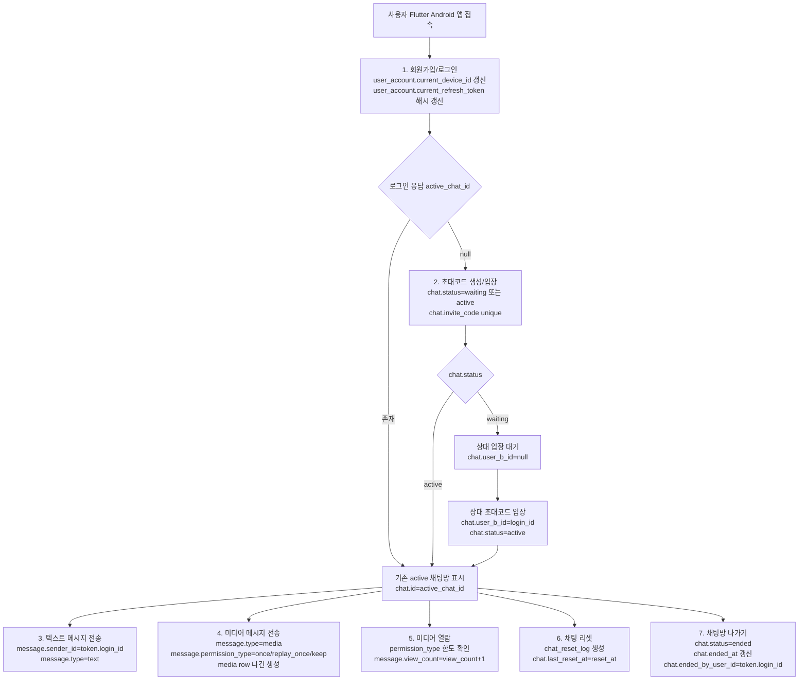
```mermaid
flowchart TD
    Start["사용자 Flutter Android 앱 접속"] --> S1["1. 회원가입/로그인<br/>user_account.current_device_id 갱신<br/>user_account.current_refresh_token 해시 갱신"]
    S1 --> C1{"로그인 응답 active_chat_id"}
    C1 -->|"존재"| S3Ready["기존 active 채팅방 표시<br/>chat.id=active_chat_id"]
    C1 -->|"null"| S2["2. 초대코드 생성/입장<br/>chat.status=waiting 또는 active<br/>chat.invite_code unique"]
    S2 --> C2{"chat.status"}
    C2 -->|"active"| S3Ready
    C2 -->|"waiting"| Wait["상대 입장 대기<br/>chat.user_b_id=null"]
    Wait --> S2Join["상대 초대코드 입장<br/>chat.user_b_id=login_id<br/>chat.status=active"]
    S2Join --> S3Ready
    S3Ready --> S3["3. 텍스트 메시지 전송<br/>message.sender_id=token.login_id<br/>message.type=text"]
    S3Ready --> S4["4. 미디어 메시지 전송<br/>message.type=media<br/>message.permission_type=once/replay_once/keep<br/>media row 다건 생성"]
    S3Ready --> S5["5. 미디어 열람<br/>permission_type 한도 확인<br/>message.view_count=view_count+1"]
    S3Ready --> S6["6. 채팅 리셋<br/>chat_reset_log 생성<br/>chat.last_reset_at=reset_at"]
    S3Ready --> S7["7. 채팅방 나가기<br/>chat.status=ended<br/>chat.ended_at 갱신<br/>chat.ended_by_user_id=token.login_id"]
```

### **1. 회원가입 및 로그인**

| 항목              | 내용                                                                                                                                   |
| ----------------- | -------------------------------------------------------------------------------------------------------------------------------------- |
| 시작 액션         | 사용자가 Flutter Android 앱에 접속한 뒤 `login_id/password`를 입력하고 회원가입 또는 로그인을 요청한다.                                        |
| DB 조회/상태 분기 | `user_account.login_id` 중복 여부, 로그인 실패 횟수 제한 여부, `password_hash` 검증 결과, active `chat` 존재 여부                      |
| 생성/변경 필드    | 회원가입: `user_account.login_id`, `password_hash`, `created_at` 생성 / 로그인: `current_device_id`, `current_refresh_token` 해시 갱신 |
| 성공 응답         | `access_token`, `refresh_token`, `login_id`, `current_device_id`, `active_chat_id`                                                     |
| 실패 코드         | `AUTH_LOGIN_ID_DUPLICATED`, `AUTH_RATE_LIMITED`, `AUTH_INVALID_CREDENTIALS`, `AUTH_DEVICE_REPLACED`                                    |

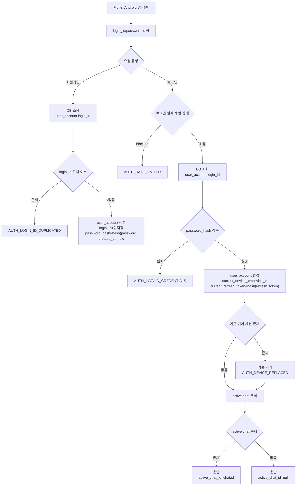
```mermaid
flowchart TD
    A["Flutter Android 앱 접속"] --> B["login_id/password 입력"]
    B --> C{"요청 유형"}
    C -->|"회원가입"| D["DB 조회<br/>user_account.login_id"]
    D --> E{"login_id 존재 여부"}
    E -->|"존재"| E1["AUTH_LOGIN_ID_DUPLICATED"]
    E -->|"없음"| E2["user_account 생성<br/>login_id=입력값<br/>password_hash=hash(password)<br/>created_at=now"]
    C -->|"로그인"| F{"로그인 실패 제한 상태"}
    F -->|"blocked"| F1["AUTH_RATE_LIMITED"]
    F -->|"허용"| G["DB 조회<br/>user_account.login_id"]
    G --> H{"password_hash 검증"}
    H -->|"실패"| H1["AUTH_INVALID_CREDENTIALS"]
    H -->|"성공"| I["user_account 변경<br/>current_device_id=device_id<br/>current_refresh_token=hash(refresh_token)"]
    I --> J{"기존 기기 세션 존재"}
    J -->|"존재"| J1["기존 기기<br/>AUTH_DEVICE_REPLACED"]
    J -->|"없음"| K["active chat 조회"]
    J1 --> K
    K --> L{"active chat 존재"}
    L -->|"존재"| L1["응답<br/>active_chat_id=chat.id"]
    L -->|"없음"| L2["응답<br/>active_chat_id=null"]
```

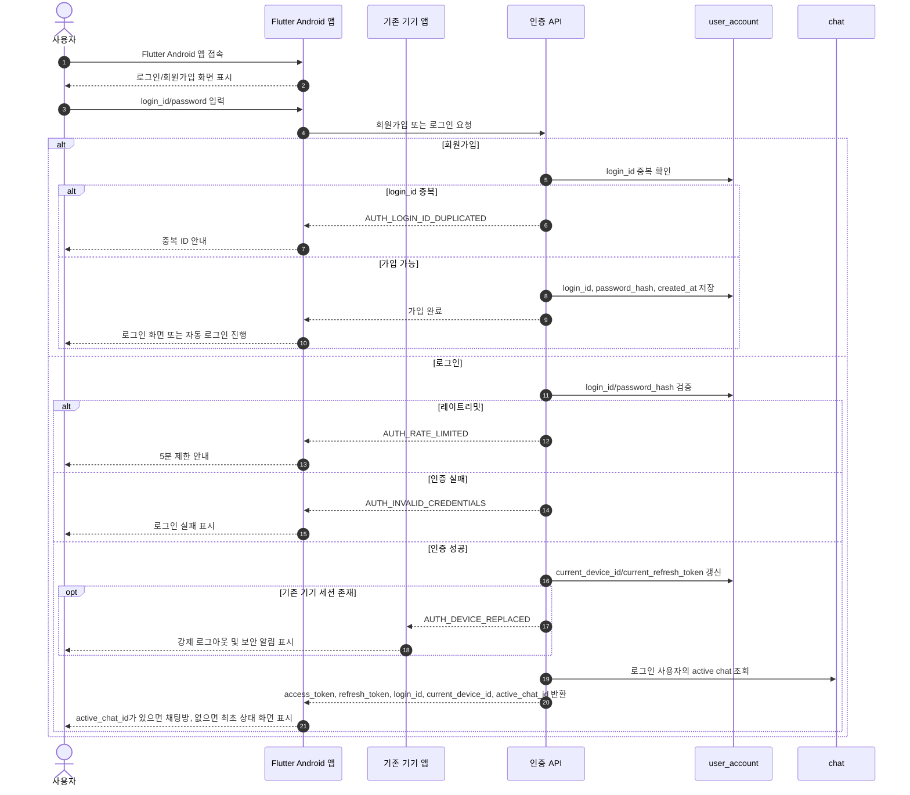
```mermaid
sequenceDiagram
    autonumber
    actor User as 사용자
    participant App as Flutter Android 앱
    participant OldApp as 기존 기기 앱
    participant Auth as 인증 API
    participant Account as user_account
    participant Chat as chat

    User->>App: Flutter Android 앱 접속
    App-->>User: 로그인/회원가입 화면 표시
    User->>App: login_id/password 입력
    App->>Auth: 회원가입 또는 로그인 요청
    alt 회원가입
        Auth->>Account: login_id 중복 확인
        alt login_id 중복
            Auth-->>App: AUTH_LOGIN_ID_DUPLICATED
            App-->>User: 중복 ID 안내
        else 가입 가능
            Auth->>Account: login_id, password_hash, created_at 저장
            Auth-->>App: 가입 완료
            App-->>User: 로그인 화면 또는 자동 로그인 진행
        end
    else 로그인
        Auth->>Account: login_id/password_hash 검증
        alt 레이트리밋
            Auth-->>App: AUTH_RATE_LIMITED
            App-->>User: 5분 제한 안내
        else 인증 실패
            Auth-->>App: AUTH_INVALID_CREDENTIALS
            App-->>User: 로그인 실패 표시
        else 인증 성공
            Auth->>Account: current_device_id/current_refresh_token 갱신
            opt 기존 기기 세션 존재
                Auth-->>OldApp: AUTH_DEVICE_REPLACED
                OldApp-->>User: 강제 로그아웃 및 보안 알림 표시
            end
            Auth->>Chat: 로그인 사용자의 active chat 조회
            Auth-->>App: access_token, refresh_token, login_id, current_device_id, active_chat_id 반환
            App-->>User: active_chat_id가 있으면 채팅방, 없으면 최초 상태 화면 표시
        end
    end
```

로그인 성공 응답:

```json
{
  "access_token": "jwt-access-token",
  "refresh_token": "refresh-token",
  "login_id": "user_login_id",
  "current_device_id": "device-id",
  "active_chat_id": 1001
}
```

- `active_chat_id`가 `null`이면 초대코드 입력/채팅방 생성 화면으로 이동한다.
- `active_chat_id`가 존재하면 채팅방 생성 요청 없이 해당 채팅방 화면으로 바로 이동한다.

### **2. 앱 진입, active 채팅방 라우팅, 초대코드 생성 및 입장**

| 항목              | 내용                                                                                                                                                                         |
| ----------------- | ---------------------------------------------------------------------------------------------------------------------------------------------------------------------------- |
| 시작 액션         | 사용자가 저장된 access token으로 앱에 진입하거나, active 채팅방이 없을 때 초대코드를 생성/입력한다.                                                                          |
| DB 조회/상태 분기 | access token 유효성, active `chat` 존재 여부, `invite_code` 조회 결과, `chat.status`, `user_b_id` 존재 여부                                                                  |
| 생성/변경 필드    | 생성: `chat.status=waiting`, `chat.user_a_id=token.login_id`, `chat.invite_code=unique`, `chat.created_at=now` / 입장: `chat.user_b_id=token.login_id`, `chat.status=active` |
| 성공 응답         | active 채팅방 화면 표시, 생성 시 `invite_code` 반환, 입장 시 채팅방 진입                                                                                                     |
| 실패 코드         | `AUTH_SESSION_EXPIRED`, `CHAT_ACTIVE_EXISTS`, `CHAT_CREATE_FAILED`, `CHAT_INVITE_RATE_LIMITED`, `CHAT_INVITE_NOT_FOUND`, `CHAT_FULL`, `CHAT_NOT_ACTIVE`, `CHAT_JOIN_FAILED`     |

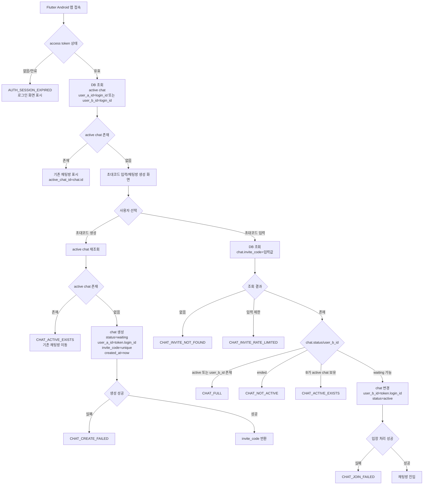
```mermaid
flowchart TD
    A["Flutter Android 앱 접속"] --> B{"access token 상태"}
    B -->|"없음/만료"| B1["AUTH_SESSION_EXPIRED<br/>로그인 화면 표시"]
    B -->|"유효"| C["DB 조회<br/>active chat<br/>user_a_id=login_id 또는 user_b_id=login_id"]
    C --> D{"active chat 존재"}
    D -->|"존재"| D1["기존 채팅방 표시<br/>active_chat_id=chat.id"]
    D -->|"없음"| E["초대코드 입력/채팅방 생성 화면"]
    E --> F{"사용자 선택"}
    F -->|"초대코드 생성"| G["active chat 재조회"]
    G --> H{"active chat 존재"}
    H -->|"존재"| H1["CHAT_ACTIVE_EXISTS<br/>기존 채팅방 이동"]
    H -->|"없음"| I["chat 생성<br/>status=waiting<br/>user_a_id=token.login_id<br/>invite_code=unique<br/>created_at=now"]
    I --> I1{"생성 성공"}
    I1 -->|"실패"| I2["CHAT_CREATE_FAILED"]
    I1 -->|"성공"| I3["invite_code 반환"]
    F -->|"초대코드 입력"| J["DB 조회<br/>chat.invite_code=입력값"]
    J --> K{"조회 결과"}
    K -->|"없음"| K1["CHAT_INVITE_NOT_FOUND"]
    K -->|"입력 제한"| K2["CHAT_INVITE_RATE_LIMITED"]
    K -->|"존재"| L{"chat.status/user_b_id"}
    L -->|"active 또는 user_b_id 존재"| L1["CHAT_FULL"]
    L -->|"ended"| L3["CHAT_NOT_ACTIVE"]
    L -->|"B가 active chat 보유"| L2["CHAT_ACTIVE_EXISTS"]
    L -->|"waiting 가능"| M["chat 변경<br/>user_b_id=token.login_id<br/>status=active"]
    M --> N{"입장 처리 성공"}
    N -->|"실패"| N1["CHAT_JOIN_FAILED"]
    N -->|"성공"| N2["채팅방 진입"]
```

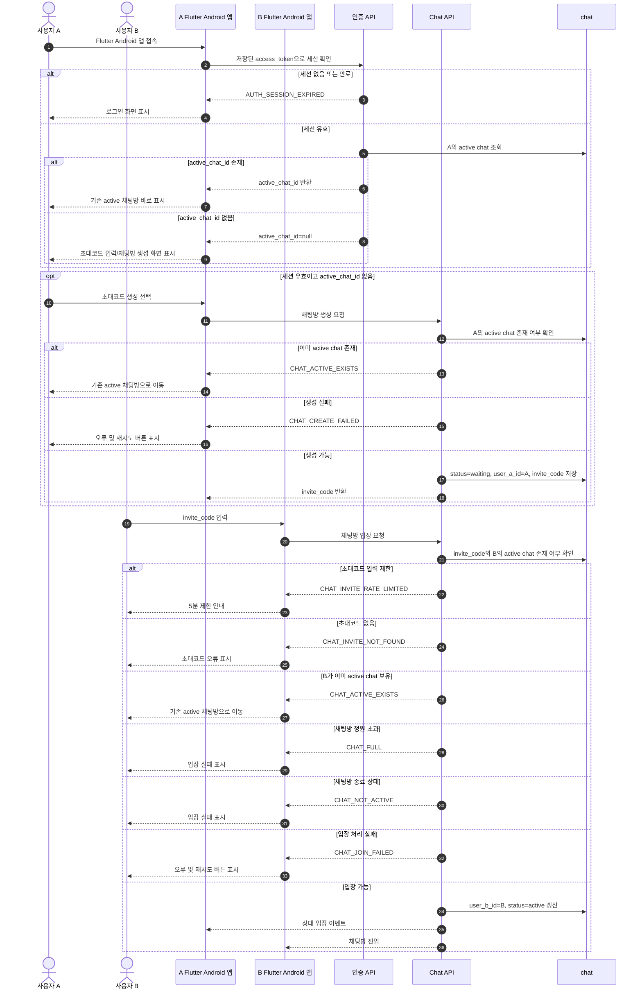
```mermaid
sequenceDiagram
    autonumber
    actor A as 사용자 A
    actor B as 사용자 B
    participant AppA as A Flutter Android 앱
    participant AppB as B Flutter Android 앱
    participant Auth as 인증 API
    participant ChatAPI as Chat API
    participant Chat as chat

    A->>AppA: Flutter Android 앱 접속
    AppA->>Auth: 저장된 access_token으로 세션 확인
    alt 세션 없음 또는 만료
        Auth-->>AppA: AUTH_SESSION_EXPIRED
        AppA-->>A: 로그인 화면 표시
    else 세션 유효
        Auth->>Chat: A의 active chat 조회
        alt active_chat_id 존재
            Auth-->>AppA: active_chat_id 반환
            AppA-->>A: 기존 active 채팅방 바로 표시
        else active_chat_id 없음
            Auth-->>AppA: active_chat_id=null
            AppA-->>A: 초대코드 입력/채팅방 생성 화면 표시
        end
    end

    opt 세션 유효이고 active_chat_id 없음
        A->>AppA: 초대코드 생성 선택
        AppA->>ChatAPI: 채팅방 생성 요청
        ChatAPI->>Chat: A의 active chat 존재 여부 확인
        alt 이미 active chat 존재
            ChatAPI-->>AppA: CHAT_ACTIVE_EXISTS
            AppA-->>A: 기존 active 채팅방으로 이동
        else 생성 실패
            ChatAPI-->>AppA: CHAT_CREATE_FAILED
            AppA-->>A: 오류 및 재시도 버튼 표시
        else 생성 가능
            ChatAPI->>Chat: status=waiting, user_a_id=A, invite_code 저장
            ChatAPI-->>AppA: invite_code 반환
        end
    end

    B->>AppB: invite_code 입력
    AppB->>ChatAPI: 채팅방 입장 요청
    ChatAPI->>Chat: invite_code와 B의 active chat 존재 여부 확인
    alt 초대코드 입력 제한
        ChatAPI-->>AppB: CHAT_INVITE_RATE_LIMITED
        AppB-->>B: 5분 제한 안내
    else 초대코드 없음
        ChatAPI-->>AppB: CHAT_INVITE_NOT_FOUND
        AppB-->>B: 초대코드 오류 표시
    else B가 이미 active chat 보유
        ChatAPI-->>AppB: CHAT_ACTIVE_EXISTS
        AppB-->>B: 기존 active 채팅방으로 이동
    else 채팅방 정원 초과
        ChatAPI-->>AppB: CHAT_FULL
        AppB-->>B: 입장 실패 표시
    else 채팅방 종료 상태
        ChatAPI-->>AppB: CHAT_NOT_ACTIVE
        AppB-->>B: 입장 실패 표시
    else 입장 처리 실패
        ChatAPI-->>AppB: CHAT_JOIN_FAILED
        AppB-->>B: 오류 및 재시도 버튼 표시
    else 입장 가능
        ChatAPI->>Chat: user_b_id=B, status=active 갱신
        ChatAPI-->>AppA: 상대 입장 이벤트
        ChatAPI-->>AppB: 채팅방 진입
    end
```

### **3. 텍스트 메시지 전송**

| 항목              | 내용                                                                                                                              |
| ----------------- | --------------------------------------------------------------------------------------------------------------------------------- |
| 시작 액션         | active 채팅방에서 사용자가 텍스트를 입력하고 전송한다.                                                                            |
| DB 조회/상태 분기 | `chat_id` 조회 결과, `chat.status`, token `login_id`가 `chat.user_a_id` 또는 `chat.user_b_id`인지 여부, `text_content` 존재 여부  |
| 생성/변경 필드    | `message.chat_id`, `message.sender_id=token.login_id`, `message.type=text`, `message.text_content`, `message.created_at=now` 생성 |
| 성공 응답         | 전송 성공 및 상대 앱에 새 메시지 전달                                                                                             |
| 실패 코드         | `CHAT_NOT_FOUND`, `CHAT_PARTICIPANT_REQUIRED`, `CHAT_NOT_ACTIVE`, `MESSAGE_EMPTY`, `MESSAGE_SEND_FAILED`                          |

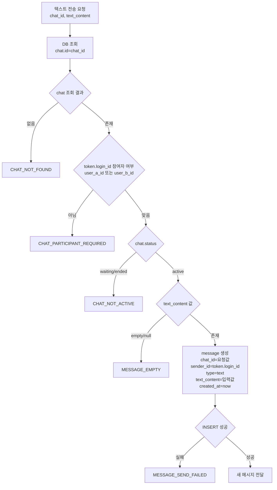
```mermaid
flowchart TD
    A["텍스트 전송 요청<br/>chat_id, text_content"] --> B["DB 조회<br/>chat.id=chat_id"]
    B --> C{"chat 조회 결과"}
    C -->|"없음"| C1["CHAT_NOT_FOUND"]
    C -->|"존재"| D{"token.login_id 참여자 여부<br/>user_a_id 또는 user_b_id"}
    D -->|"아님"| D1["CHAT_PARTICIPANT_REQUIRED"]
    D -->|"맞음"| E{"chat.status"}
    E -->|"waiting/ended"| E1["CHAT_NOT_ACTIVE"]
    E -->|"active"| F{"text_content 값"}
    F -->|"empty/null"| F1["MESSAGE_EMPTY"]
    F -->|"존재"| G["message 생성<br/>chat_id=요청값<br/>sender_id=token.login_id<br/>type=text<br/>text_content=입력값<br/>created_at=now"]
    G --> H{"INSERT 성공"}
    H -->|"실패"| H1["MESSAGE_SEND_FAILED"]
    H -->|"성공"| H2["새 메시지 전달"]
```

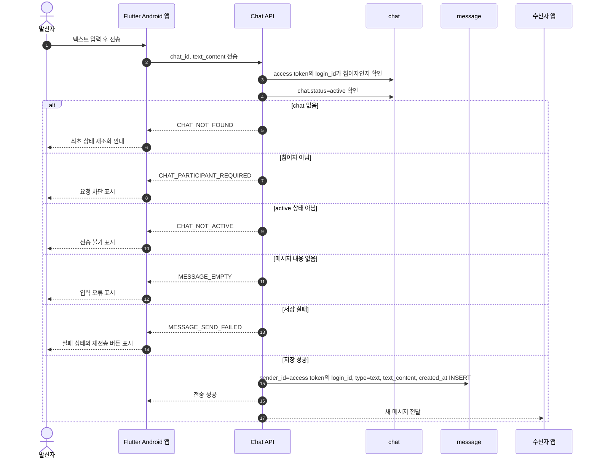
```mermaid
sequenceDiagram
    autonumber
    actor Sender as 발신자
    participant App as Flutter Android 앱
    participant ChatAPI as Chat API
    participant Chat as chat
    participant Msg as message
    participant Receiver as 수신자 앱

    Sender->>App: 텍스트 입력 후 전송
    App->>ChatAPI: chat_id, text_content 전송
    ChatAPI->>Chat: access token의 login_id가 참여자인지 확인
    ChatAPI->>Chat: chat.status=active 확인
    alt chat 없음
        ChatAPI-->>App: CHAT_NOT_FOUND
        App-->>Sender: 최초 상태 재조회 안내
    else 참여자 아님
        ChatAPI-->>App: CHAT_PARTICIPANT_REQUIRED
        App-->>Sender: 요청 차단 표시
    else active 상태 아님
        ChatAPI-->>App: CHAT_NOT_ACTIVE
        App-->>Sender: 전송 불가 표시
    else 메시지 내용 없음
        ChatAPI-->>App: MESSAGE_EMPTY
        App-->>Sender: 입력 오류 표시
    else 저장 실패
        ChatAPI-->>App: MESSAGE_SEND_FAILED
        App-->>Sender: 실패 상태와 재전송 버튼 표시
    else 저장 성공
        ChatAPI->>Msg: sender_id=access token의 login_id, type=text, text_content, created_at INSERT
        ChatAPI-->>App: 전송 성공
        ChatAPI-->>Receiver: 새 메시지 전달
    end
```

메시지 전송 검증 설명:

- 클라이언트는 `sender_id`를 보내지 않는다.
- 서버는 access token에서 확인한 `login_id`를 `message.sender_id`로 사용한다.
- 서버는 이 `login_id`가 `chat.user_a_id` 또는 `chat.user_b_id`인지 검증한다.
- 서버는 `chat.status=active`인지 확인해 `waiting`/`ended` 상태의 메시지 전송을 차단한다.

### **4. 미디어 메시지 전송**

| 항목              | 내용                                                                                                                                                                                       |
| ----------------- | ------------------------------------------------------------------------------------------------------------------------------------------------------------------------------------------ |
| 시작 액션         | active 채팅방에서 사용자가 사진/영상을 선택하거나 촬영하고 권한을 선택한다.                                                                                                                |
| DB 조회/상태 분기 | `chat_id` 조회 결과, `chat.status`, token `login_id` 참여자 여부, 사진/영상 개수와 크기 제한, 업로드/저장 성공 여부                                                                        |
| 생성/변경 필드    | `message.sender_id=token.login_id`, `message.type=media`, `message.permission_type`, `message.created_at=now`, `media.message_id`, `media.url`, `media.mime_type`, `media.created_at` 생성 |
| 성공 응답         | 새 미디어 메시지 전달                                                                                                                                                                      |
| 실패 코드         | `MEDIA_LIMIT_EXCEEDED`, `CHAT_NOT_FOUND`, `CHAT_PARTICIPANT_REQUIRED`, `CHAT_NOT_ACTIVE`, `MEDIA_UPLOAD_FAILED`, `MESSAGE_SEND_FAILED`                                                     |

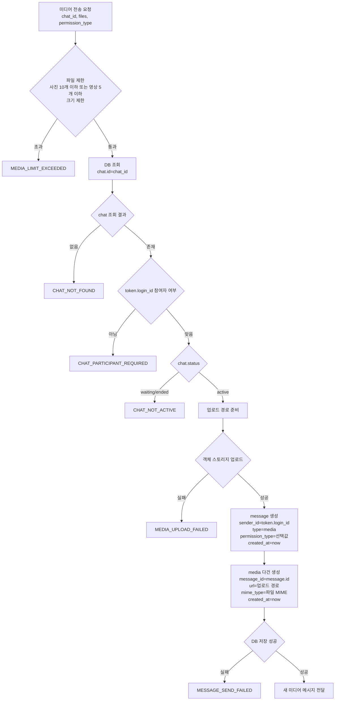
```mermaid
flowchart TD
    A["미디어 전송 요청<br/>chat_id, files, permission_type"] --> B{"파일 제한<br/>사진 10개 이하 또는 영상 5개 이하<br/>크기 제한"}
    B -->|"초과"| B1["MEDIA_LIMIT_EXCEEDED"]
    B -->|"통과"| C["DB 조회<br/>chat.id=chat_id"]
    C --> D{"chat 조회 결과"}
    D -->|"없음"| D1["CHAT_NOT_FOUND"]
    D -->|"존재"| E{"token.login_id 참여자 여부"}
    E -->|"아님"| E1["CHAT_PARTICIPANT_REQUIRED"]
    E -->|"맞음"| F{"chat.status"}
    F -->|"waiting/ended"| F1["CHAT_NOT_ACTIVE"]
    F -->|"active"| G["업로드 경로 준비"]
    G --> H{"객체 스토리지 업로드"}
    H -->|"실패"| H1["MEDIA_UPLOAD_FAILED"]
    H -->|"성공"| I["message 생성<br/>sender_id=token.login_id<br/>type=media<br/>permission_type=선택값<br/>created_at=now"]
    I --> J["media 다건 생성<br/>message_id=message.id<br/>url=업로드 경로<br/>mime_type=파일 MIME<br/>created_at=now"]
    J --> K{"DB 저장 성공"}
    K -->|"실패"| K1["MESSAGE_SEND_FAILED"]
    K -->|"성공"| K2["새 미디어 메시지 전달"]
```

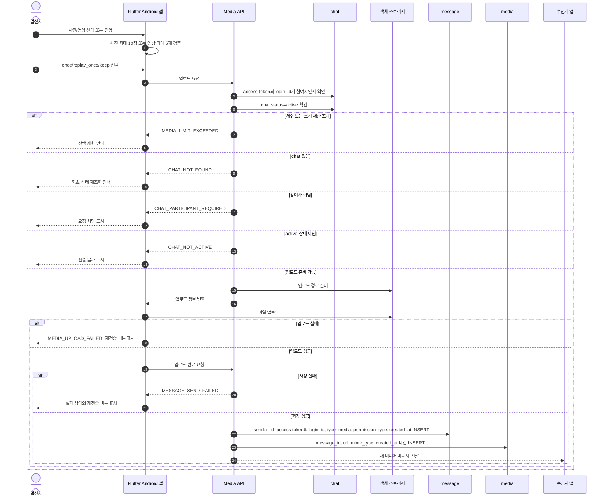
```mermaid
sequenceDiagram
    autonumber
    actor Sender as 발신자
    participant App as Flutter Android 앱
    participant MediaAPI as Media API
    participant Chat as chat
    participant Storage as 객체 스토리지
    participant Msg as message
    participant Media as media
    participant Receiver as 수신자 앱

    Sender->>App: 사진/영상 선택 또는 촬영
    App->>App: 사진 최대 10장 또는 영상 최대 5개 검증
    Sender->>App: once/replay_once/keep 선택
    App->>MediaAPI: 업로드 요청
    MediaAPI->>Chat: access token의 login_id가 참여자인지 확인
    MediaAPI->>Chat: chat.status=active 확인
    alt 개수 또는 크기 제한 초과
        MediaAPI-->>App: MEDIA_LIMIT_EXCEEDED
        App-->>Sender: 선택 제한 안내
    else chat 없음
        MediaAPI-->>App: CHAT_NOT_FOUND
        App-->>Sender: 최초 상태 재조회 안내
    else 참여자 아님
        MediaAPI-->>App: CHAT_PARTICIPANT_REQUIRED
        App-->>Sender: 요청 차단 표시
    else active 상태 아님
        MediaAPI-->>App: CHAT_NOT_ACTIVE
        App-->>Sender: 전송 불가 표시
    else 업로드 준비 가능
        MediaAPI->>Storage: 업로드 경로 준비
        MediaAPI-->>App: 업로드 정보 반환
        App->>Storage: 파일 업로드
        alt 업로드 실패
            App-->>Sender: MEDIA_UPLOAD_FAILED, 재전송 버튼 표시
        else 업로드 성공
            App->>MediaAPI: 업로드 완료 요청
            alt 저장 실패
                MediaAPI-->>App: MESSAGE_SEND_FAILED
                App-->>Sender: 실패 상태와 재전송 버튼 표시
            else 저장 성공
                MediaAPI->>Msg: sender_id=access token의 login_id, type=media, permission_type, created_at INSERT
                MediaAPI->>Media: message_id, url, mime_type, created_at 다건 INSERT
                MediaAPI-->>Receiver: 새 미디어 메시지 전달
            end
        end
    end
```

### **5. 미디어 열람**

| 항목              | 내용                                                                                                                                                      |
| ----------------- | --------------------------------------------------------------------------------------------------------------------------------------------------------- |
| 시작 액션         | 수신자가 미디어 메시지를 열람한다.                                                                                                                        |
| DB 조회/상태 분기 | `message_id`로 `message/chat/media` 조회, `chat.status`, token `login_id` 참여자 여부, `permission_type` 기준 `view_count` 한도                           |
| 생성/변경 필드    | 열람 가능 시 `message.view_count=view_count+1` 즉시 변경                                                                                                  |
| 성공 응답         | `view_count` 증가 후 미디어 URL 반환                                                                                                                      |
| 실패 코드         | `CHAT_NOT_FOUND`, `CHAT_PARTICIPANT_REQUIRED`, `CHAT_NOT_ACTIVE`, `MEDIA_VIEW_LIMIT_EXCEEDED`, `MEDIA_VIEW_COUNT_UPDATE_FAILED`, `MEDIA_URL_ISSUE_FAILED` |

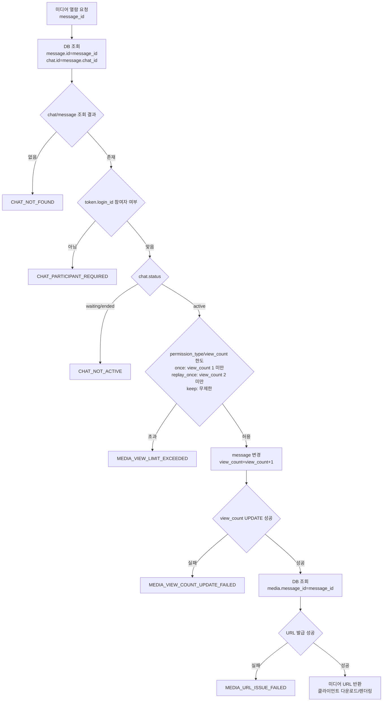
```mermaid
flowchart TD
    A["미디어 열람 요청<br/>message_id"] --> B["DB 조회<br/>message.id=message_id<br/>chat.id=message.chat_id"]
    B --> C{"chat/message 조회 결과"}
    C -->|"없음"| C1["CHAT_NOT_FOUND"]
    C -->|"존재"| D{"token.login_id 참여자 여부"}
    D -->|"아님"| D1["CHAT_PARTICIPANT_REQUIRED"]
    D -->|"맞음"| E{"chat.status"}
    E -->|"waiting/ended"| E1["CHAT_NOT_ACTIVE"]
    E -->|"active"| F{"permission_type/view_count 한도<br/>once: view_count 1 미만<br/>replay_once: view_count 2 미만<br/>keep: 무제한"}
    F -->|"초과"| F1["MEDIA_VIEW_LIMIT_EXCEEDED"]
    F -->|"허용"| G["message 변경<br/>view_count=view_count+1"]
    G --> H{"view_count UPDATE 성공"}
    H -->|"실패"| H1["MEDIA_VIEW_COUNT_UPDATE_FAILED"]
    H -->|"성공"| I["DB 조회<br/>media.message_id=message_id"]
    I --> J{"URL 발급 성공"}
    J -->|"실패"| J1["MEDIA_URL_ISSUE_FAILED"]
    J -->|"성공"| J2["미디어 URL 반환<br/>클라이언트 다운로드/렌더링"]
```

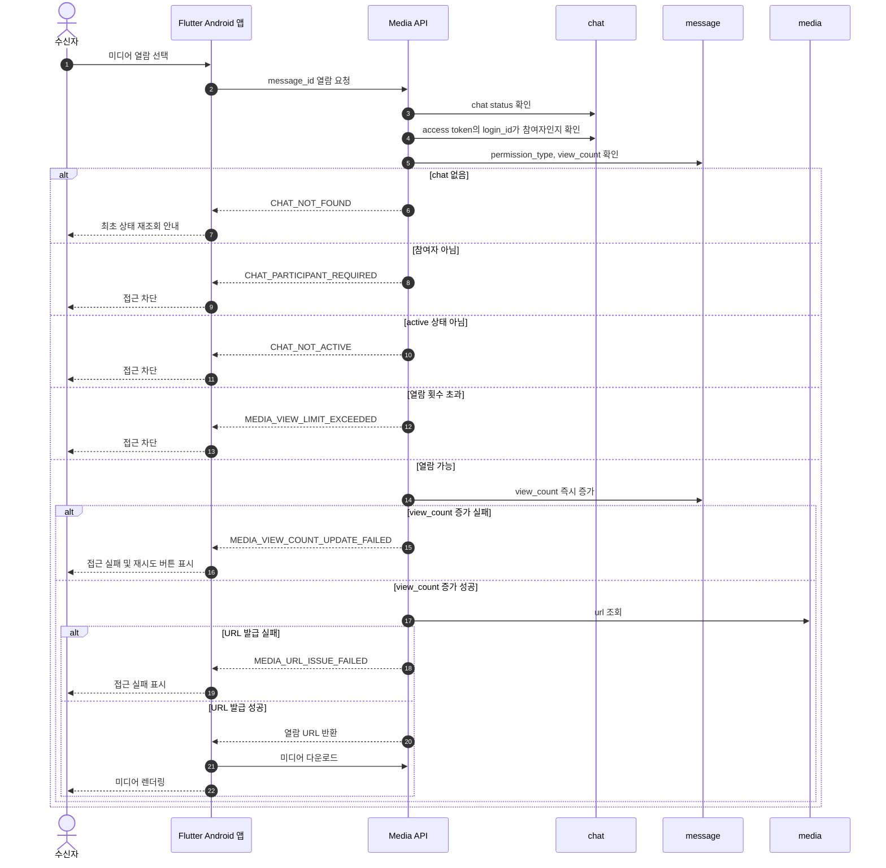
```mermaid
sequenceDiagram
    autonumber
    actor Viewer as 수신자
    participant App as Flutter Android 앱
    participant MediaAPI as Media API
    participant Chat as chat
    participant Msg as message
    participant Media as media

    Viewer->>App: 미디어 열람 선택
    App->>MediaAPI: message_id 열람 요청
    MediaAPI->>Chat: chat status 확인
    MediaAPI->>Chat: access token의 login_id가 참여자인지 확인
    MediaAPI->>Msg: permission_type, view_count 확인
    alt chat 없음
        MediaAPI-->>App: CHAT_NOT_FOUND
        App-->>Viewer: 최초 상태 재조회 안내
    else 참여자 아님
        MediaAPI-->>App: CHAT_PARTICIPANT_REQUIRED
        App-->>Viewer: 접근 차단
    else active 상태 아님
        MediaAPI-->>App: CHAT_NOT_ACTIVE
        App-->>Viewer: 접근 차단
    else 열람 횟수 초과
        MediaAPI-->>App: MEDIA_VIEW_LIMIT_EXCEEDED
        App-->>Viewer: 접근 차단
    else 열람 가능
        MediaAPI->>Msg: view_count 즉시 증가
        alt view_count 증가 실패
            MediaAPI-->>App: MEDIA_VIEW_COUNT_UPDATE_FAILED
            App-->>Viewer: 접근 실패 및 재시도 버튼 표시
        else view_count 증가 성공
            MediaAPI->>Media: url 조회
            alt URL 발급 실패
                MediaAPI-->>App: MEDIA_URL_ISSUE_FAILED
                App-->>Viewer: 접근 실패 표시
            else URL 발급 성공
                MediaAPI-->>App: 열람 URL 반환
                App->>MediaAPI: 미디어 다운로드
                App-->>Viewer: 미디어 렌더링
            end
        end
    end
```

### **6. 채팅 리셋**

| 항목              | 내용                                                                                                                  |
| ----------------- | --------------------------------------------------------------------------------------------------------------------- |
| 시작 액션         | 참여자가 대화 내역 초기화를 선택한다.                                                                                 |
| DB 조회/상태 분기 | `chat_id` 조회 결과, token `login_id`가 참여자인지 여부                                                               |
| 생성/변경 필드    | `chat_reset_log.chat_id`, `reset_by_user_id=token.login_id`, `reset_at=now` 생성 / `chat.last_reset_at=reset_at` 변경 |
| 성공 응답         | `last_reset_at` 이후 메시지만 반환                                                                                    |
| 실패 코드         | `CHAT_NOT_FOUND`, `CHAT_PARTICIPANT_REQUIRED`, `CHAT_RESET_FAILED`                                                    |

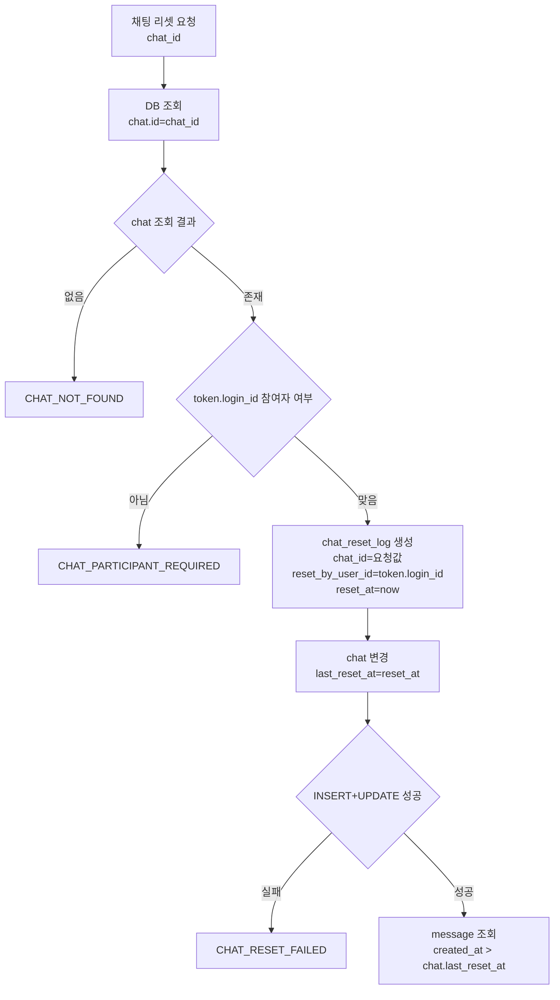
```mermaid
flowchart TD
    A["채팅 리셋 요청<br/>chat_id"] --> B["DB 조회<br/>chat.id=chat_id"]
    B --> C{"chat 조회 결과"}
    C -->|"없음"| C1["CHAT_NOT_FOUND"]
    C -->|"존재"| D{"token.login_id 참여자 여부"}
    D -->|"아님"| D1["CHAT_PARTICIPANT_REQUIRED"]
    D -->|"맞음"| E["chat_reset_log 생성<br/>chat_id=요청값<br/>reset_by_user_id=token.login_id<br/>reset_at=now"]
    E --> F["chat 변경<br/>last_reset_at=reset_at"]
    F --> G{"INSERT+UPDATE 성공"}
    G -->|"실패"| G1["CHAT_RESET_FAILED"]
    G -->|"성공"| G2["message 조회<br/>created_at > chat.last_reset_at"]
```

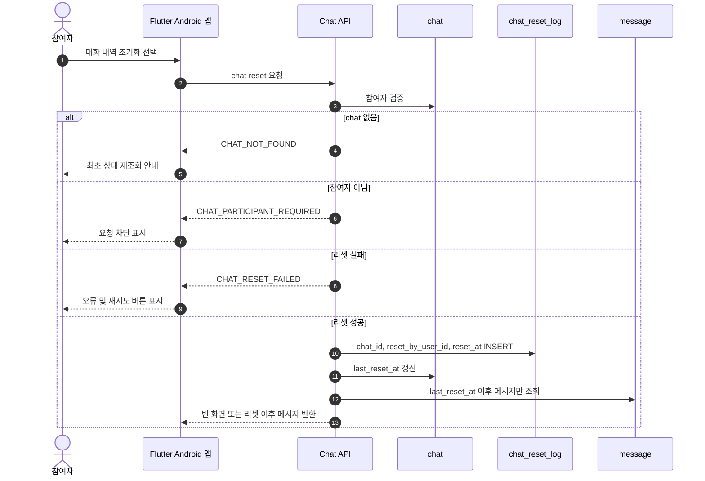
```mermaid
sequenceDiagram
    autonumber
    actor User as 참여자
    participant App as Flutter Android 앱
    participant ChatAPI as Chat API
    participant Chat as chat
    participant Reset as chat_reset_log
    participant Msg as message

    User->>App: 대화 내역 초기화 선택
    App->>ChatAPI: chat reset 요청
    ChatAPI->>Chat: 참여자 검증
    alt chat 없음
        ChatAPI-->>App: CHAT_NOT_FOUND
        App-->>User: 최초 상태 재조회 안내
    else 참여자 아님
        ChatAPI-->>App: CHAT_PARTICIPANT_REQUIRED
        App-->>User: 요청 차단 표시
    else 리셋 실패
        ChatAPI-->>App: CHAT_RESET_FAILED
        App-->>User: 오류 및 재시도 버튼 표시
    else 리셋 성공
        ChatAPI->>Reset: chat_id, reset_by_user_id, reset_at INSERT
        ChatAPI->>Chat: last_reset_at 갱신
        ChatAPI->>Msg: last_reset_at 이후 메시지만 조회
        ChatAPI-->>App: 빈 화면 또는 리셋 이후 메시지 반환
    end
```

### **7. 채팅방 나가기**

| 항목              | 내용                                                                                  |
| ----------------- | ------------------------------------------------------------------------------------- |
| 시작 액션         | 참여자가 채팅방 나가기를 선택한다.                                                    |
| DB 조회/상태 분기 | `chat_id` 조회 결과, token `login_id`가 참여자인지 여부                               |
| 생성/변경 필드    | `chat.status=ended`, `chat.ended_at=now`, `chat.ended_by_user_id=token.login_id` 변경 |
| 성공 응답         | 양측 최초 상태 화면으로 이동                                                          |
| 실패 코드         | `CHAT_NOT_FOUND`, `CHAT_PARTICIPANT_REQUIRED`, `CHAT_LEAVE_FAILED`                    |

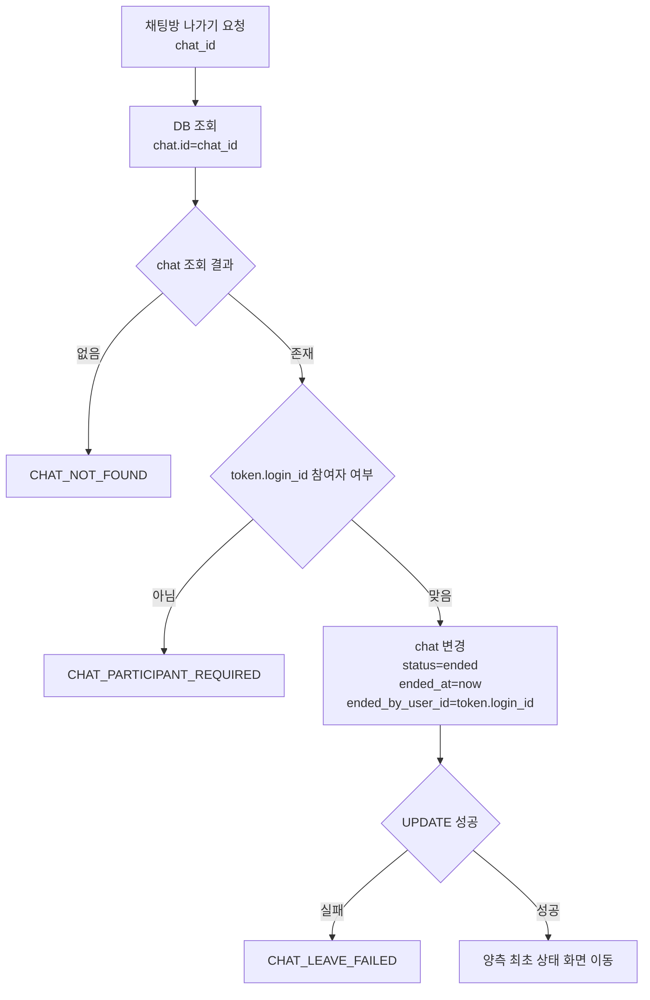
```mermaid
flowchart TD
    A["채팅방 나가기 요청<br/>chat_id"] --> B["DB 조회<br/>chat.id=chat_id"]
    B --> C{"chat 조회 결과"}
    C -->|"없음"| C1["CHAT_NOT_FOUND"]
    C -->|"존재"| D{"token.login_id 참여자 여부"}
    D -->|"아님"| D1["CHAT_PARTICIPANT_REQUIRED"]
    D -->|"맞음"| E["chat 변경<br/>status=ended<br/>ended_at=now<br/>ended_by_user_id=token.login_id"]
    E --> F{"UPDATE 성공"}
    F -->|"실패"| F1["CHAT_LEAVE_FAILED"]
    F -->|"성공"| F2["양측 최초 상태 화면 이동"]
```

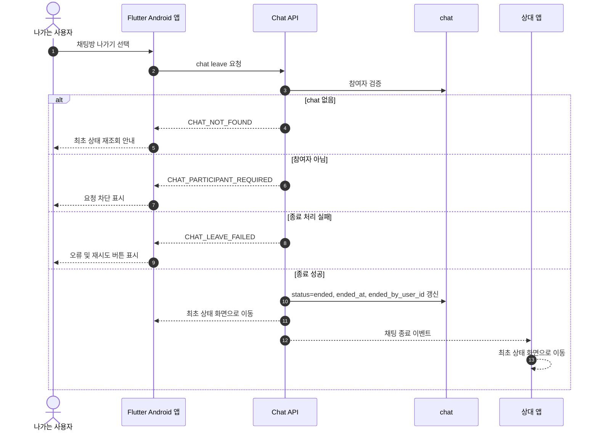
```mermaid
sequenceDiagram
    autonumber
    actor User as 나가는 사용자
    participant App as Flutter Android 앱
    participant ChatAPI as Chat API
    participant Chat as chat
    participant Peer as 상대 앱

    User->>App: 채팅방 나가기 선택
    App->>ChatAPI: chat leave 요청
    ChatAPI->>Chat: 참여자 검증
    alt chat 없음
        ChatAPI-->>App: CHAT_NOT_FOUND
        App-->>User: 최초 상태 재조회 안내
    else 참여자 아님
        ChatAPI-->>App: CHAT_PARTICIPANT_REQUIRED
        App-->>User: 요청 차단 표시
    else 종료 처리 실패
        ChatAPI-->>App: CHAT_LEAVE_FAILED
        App-->>User: 오류 및 재시도 버튼 표시
    else 종료 성공
        ChatAPI->>Chat: status=ended, ended_at, ended_by_user_id 갱신
        ChatAPI-->>App: 최초 상태 화면으로 이동
        ChatAPI-->>Peer: 채팅 종료 이벤트
        Peer-->>Peer: 최초 상태 화면으로 이동
    end
```

## **외부 호출자용 API 계약**

### 공통 규칙

| 항목 | 계약 |
| --- | --- |
| Base path | `/api` |
| 인증 헤더 | 인증 필요 API는 `Authorization: Bearer <access_token>` 사용 |
| 단일 기기 검증 | 인증 필요 API는 access token의 `device_id`와 `user_account.current_device_id`를 매 요청마다 비교한다. |
| 발신자 결정 | 클라이언트는 `sender_id`를 보내지 않는다. 서버가 access token의 subject인 `login_id`를 사용한다. |
| 시간값 | 서버가 `created_at`, `reset_at`, `ended_at`을 생성한다. |
| DB FK | DB FK 제약은 두지 않고 API 서비스 계층에서 참조 무결성을 검증한다. |

공통 오류 응답:

```json
{
  "error": {
    "code": "CHAT_NOT_FOUND",
    "message": "채팅방을 찾을 수 없습니다.",
    "retryable": false
  }
}
```

인증 필요 API 공통 오류:

| 코드 | 조건 |
| --- | --- |
| `AUTH_SESSION_EXPIRED` | access token이 없거나 만료됨 |
| `AUTH_DEVICE_REPLACED` | access token의 `device_id`가 `user_account.current_device_id`와 다름 |

### API 목록

| Method | Path | 목적 | 인증 |
| --- | --- | --- | --- |
| `POST` | `/api/users` | 회원가입 | 불필요 |
| `POST` | `/api/auth/tokens` | 로그인 및 token 생성 | 불필요 |
| `POST` | `/api/auth/token-refreshes` | access token 재발급 | refresh token 필요 |
| `GET` | `/api/chats/active` | 현재 active 채팅방 조회 | 필요 |
| `POST` | `/api/chats` | 초대코드가 있는 waiting 채팅방 생성 | 필요 |
| `POST` | `/api/chat-participants` | 초대코드로 채팅방 참여 | 필요 |
| `GET` | `/api/chats/{chat_id}/messages` | 채팅방 메시지 목록 조회 | 필요 |
| `POST` | `/api/media-upload-intents` | 미디어 업로드 URL 발급 | 필요 |
| `POST` | `/api/messages` | 텍스트 또는 미디어 메시지 생성 | 필요 |
| `POST` | `/api/media-accesses` | 미디어 열람 URL 발급 및 `view_count` 차감 | 필요 |
| `POST` | `/api/chat-reset-logs` | 채팅 리셋 실행 | 필요 |
| `POST` | `/api/chat-terminations` | 채팅방 나가기/종료 | 필요 |

### `POST /api/users`

| 항목 | 내용 |
| --- | --- |
| 목적 | `user_account`를 생성한다. |
| 인증 | 불필요 |
| 생성/변경 엔티티 | `user_account` 생성 |
| 책임 | `login_id` 중복을 막고 `password_hash`, `created_at`을 서버에서 생성한다. |

요청 필드:

| 필드 | 타입 | 필수 | 설명 |
| --- | --- | --- | --- |
| `login_id` | string | Y | 계정 PK로 사용할 로그인 ID |
| `password` | string | Y | 서버에서 `password_hash`로 변환할 평문 비밀번호 |

성공 응답 필드:

| 필드 | 타입 | 설명 |
| --- | --- | --- |
| `login_id` | string | 생성된 계정 식별자 |
| `created_at` | string | 서버 생성 가입 시각 |

성공 조건:

- `user_account.login_id` 조회 결과가 없어야 한다.
- `user_account.login_id`, `password_hash`, `created_at` INSERT가 성공해야 한다.

오류 조건:

| 코드 | 조건 |
| --- | --- |
| `AUTH_LOGIN_ID_DUPLICATED` | 같은 `login_id`가 이미 존재 |

### `POST /api/auth/tokens`

| 항목 | 내용 |
| --- | --- |
| 목적 | 로그인하고 access/refresh token을 생성한다. |
| 인증 | 불필요 |
| 생성/변경 엔티티 | `user_account.current_device_id`, `user_account.current_refresh_token` 변경 |
| 책임 | 비밀번호 검증, 단일 기기 갱신, refresh token 해시 저장, active 채팅방 조회를 수행한다. |

요청 필드:

| 필드 | 타입 | 필수 | 설명 |
| --- | --- | --- | --- |
| `login_id` | string | Y | 로그인 ID |
| `password` | string | Y | 비밀번호 |
| `device_id` | string | Y | 현재 Android 기기 식별자 |

성공 응답 필드:

| 필드 | 타입 | 설명 |
| --- | --- | --- |
| `access_token` | string | `login_id`, `device_id` claim을 포함한 access token |
| `refresh_token` | string | 클라이언트에만 내려주는 refresh token 평문 |
| `login_id` | string | 로그인 사용자 |
| `current_device_id` | string | 현재 유효 기기 |
| `active_chat_id` | number/null | active 채팅방이 있으면 `chat.id`, 없으면 null |

성공 조건:

- `user_account.login_id`가 존재해야 한다.
- `password_hash` 검증이 성공해야 한다.
- `user_account.current_device_id=device_id`, `current_refresh_token=hash(refresh_token)` 갱신이 성공해야 한다.

오류 조건:

| 코드 | 조건 |
| --- | --- |
| `AUTH_RATE_LIMITED` | 로그인 실패 제한 중 |
| `AUTH_INVALID_CREDENTIALS` | 계정 없음 또는 비밀번호 불일치 |
| `AUTH_DEVICE_REPLACED` | 기존 기기에 통보되는 강제 로그아웃 이벤트 |

### `POST /api/auth/token-refreshes`

| 항목 | 내용 |
| --- | --- |
| 목적 | refresh token으로 새 access token을 발급한다. |
| 인증 | refresh token 필요 |
| 생성/변경 엔티티 | 기본 변경 없음. refresh token rotation을 도입하면 `user_account.current_refresh_token` 변경 |
| 책임 | 전달된 refresh token의 해시가 `user_account.current_refresh_token`과 일치하는지 확인한다. |

요청 필드:

| 필드 | 타입 | 필수 | 설명 |
| --- | --- | --- | --- |
| `login_id` | string | Y | refresh token 소유자 |
| `refresh_token` | string | Y | 클라이언트가 보관 중인 refresh token |
| `device_id` | string | Y | 현재 기기 식별자 |

성공 응답 필드:

| 필드 | 타입 | 설명 |
| --- | --- | --- |
| `access_token` | string | 새 access token |
| `login_id` | string | token 주체 |
| `current_device_id` | string | 현재 유효 기기 |

오류 조건:

| 코드 | 조건 |
| --- | --- |
| `AUTH_SESSION_EXPIRED` | refresh token 해시 불일치 또는 만료 |
| `AUTH_DEVICE_REPLACED` | `device_id`가 `user_account.current_device_id`와 다름 |

### `GET /api/chats/active`

| 항목 | 내용 |
| --- | --- |
| 목적 | 로그인 사용자의 active 채팅방을 조회한다. |
| 인증 | 필요 |
| 생성/변경 엔티티 | 없음 |
| 책임 | 앱 진입 시 active 채팅방 라우팅을 위한 단일 조회를 제공한다. |

요청 필드:

| 필드 | 위치 | 필수 | 설명 |
| --- | --- | --- | --- |
| `Authorization` | header | Y | Bearer access token |

성공 응답 필드:

| 필드 | 타입 | 설명 |
| --- | --- | --- |
| `active_chat_id` | number/null | active 채팅방 id 또는 null |
| `status` | string/null | active 채팅방이 있으면 `active` |
| `user_a_id` | string/null | 첫 번째 참여자 |
| `user_b_id` | string/null | 두 번째 참여자 |
| `last_reset_at` | string/null | 리셋 기준 시각 |

성공 조건:

- token의 `login_id`가 `chat.user_a_id` 또는 `chat.user_b_id`인 `status=active` 채팅방을 조회한다.
- 결과가 없으면 오류가 아니라 `active_chat_id=null`을 반환한다.

### `POST /api/chats`

| 항목 | 내용 |
| --- | --- |
| 목적 | 초대코드가 있는 waiting 채팅방을 생성한다. |
| 인증 | 필요 |
| 생성/변경 엔티티 | `chat` 생성 |
| 책임 | 사용자가 active 채팅방을 이미 가지고 있는지 확인하고, 고유 `invite_code`를 가진 `waiting` 채팅방을 만든다. |

요청 필드:

| 필드 | 타입 | 필수 | 설명 |
| --- | --- | --- | --- |
| 없음 | - | - | 생성자는 access token의 `login_id`로 결정 |

성공 응답 필드:

| 필드 | 타입 | 설명 |
| --- | --- | --- |
| `chat_id` | number | 생성된 `chat.id` |
| `status` | string | `waiting` |
| `user_a_id` | string | token의 `login_id` |
| `user_b_id` | null | 입장 전이므로 null |
| `invite_code` | string | 고유 초대코드 |
| `created_at` | string | 생성 시각 |

성공 조건:

- token의 `login_id`가 참여 중인 `status=active` 채팅방이 없어야 한다.
- `chat.status=waiting`, `user_a_id=token.login_id`, `invite_code=unique`, `created_at=now` INSERT가 성공해야 한다.

오류 조건:

| 코드 | 조건 |
| --- | --- |
| `CHAT_ACTIVE_EXISTS` | 사용자가 이미 active 채팅방 보유 |
| `CHAT_CREATE_FAILED` | `chat` INSERT 또는 `invite_code` 생성 실패 |

### `POST /api/chat-participants`

| 항목 | 내용 |
| --- | --- |
| 목적 | 초대코드로 waiting 채팅방의 두 번째 참여자가 된다. |
| 인증 | 필요 |
| 생성/변경 엔티티 | `chat.user_b_id`, `chat.status` 변경 |
| 책임 | `invite_code` 조회, 정원/상태 확인, 사용자 active 채팅방 보유 여부 확인 후 입장을 처리한다. |

요청 필드:

| 필드 | 타입 | 필수 | 설명 |
| --- | --- | --- | --- |
| `invite_code` | string | Y | 참여할 채팅방의 초대코드 |

성공 응답 필드:

| 필드 | 타입 | 설명 |
| --- | --- | --- |
| `chat_id` | number | 입장한 채팅방 |
| `status` | string | `active` |
| `user_a_id` | string | 첫 번째 참여자 |
| `user_b_id` | string | token의 `login_id` |

성공 조건:

- `chat.invite_code=invite_code` 조회 결과가 있어야 한다.
- 조회된 `chat.status=waiting`이고 `user_b_id`가 null이어야 한다.
- token의 `login_id`가 active 채팅방을 가지고 있지 않아야 한다.
- `chat.user_b_id=token.login_id`, `chat.status=active` UPDATE가 성공해야 한다.

오류 조건:

| 코드 | 조건 |
| --- | --- |
| `CHAT_INVITE_RATE_LIMITED` | 초대코드 입력 실패 제한 중 |
| `CHAT_INVITE_NOT_FOUND` | 초대코드 조회 결과 없음 |
| `CHAT_ACTIVE_EXISTS` | 입장 사용자가 이미 active 채팅방 보유 |
| `CHAT_FULL` | `user_b_id`가 이미 존재하거나 `chat.status=active` |
| `CHAT_NOT_ACTIVE` | `chat.status=ended` |
| `CHAT_JOIN_FAILED` | `user_b_id`, `status` UPDATE 실패 |

### `GET /api/chats/{chat_id}/messages`

| 항목 | 내용 |
| --- | --- |
| 목적 | 채팅방 화면에 표시할 메시지 목록을 조회한다. |
| 인증 | 필요 |
| 생성/변경 엔티티 | 없음 |
| 책임 | 참여자 검증 후 `chat.last_reset_at` 이후 메시지만 `message.id` 증가 순으로 반환한다. |

요청 필드:

| 필드 | 위치 | 필수 | 설명 |
| --- | --- | --- | --- |
| `chat_id` | path | Y | 조회할 채팅방 id |
| `after_message_id` | query | N | 이 id보다 큰 메시지만 조회 |
| `limit` | query | N | 반환 개수 제한 |

성공 응답 필드:

| 필드 | 타입 | 설명 |
| --- | --- | --- |
| `chat_id` | number | 채팅방 id |
| `last_reset_at` | string/null | 화면 노출 기준 시각 |
| `messages` | array | `message` 목록 |

`messages` 항목 필드:

| 필드 | 타입 | 설명 |
| --- | --- | --- |
| `id` | number | 메시지 id |
| `sender_id` | string | 발신자 `login_id` |
| `type` | string | `text` 또는 `media` |
| `text_content` | string/null | 텍스트 내용 |
| `permission_type` | string/null | 미디어 권한 |
| `view_count` | number | 메시지 전체 기준 열람 횟수 |
| `media` | array | 연결된 미디어 목록 |
| `created_at` | string | 생성 시각 |

성공 조건:

- `chat.id=chat_id`가 존재해야 한다.
- token의 `login_id`가 `chat.user_a_id` 또는 `chat.user_b_id`여야 한다.
- `message.created_at > chat.last_reset_at` 조건을 적용한다. `last_reset_at=null`이면 전체 메시지를 조회한다.

오류 조건:

| 코드 | 조건 |
| --- | --- |
| `CHAT_NOT_FOUND` | 채팅방 없음 |
| `CHAT_PARTICIPANT_REQUIRED` | 참여자가 아님 |
| `CHAT_NOT_ACTIVE` | 채팅방이 `ended`라 클라이언트 화면 노출 대상이 아님 |

### `POST /api/media-upload-intents`

| 항목 | 내용 |
| --- | --- |
| 목적 | 미디어 파일 업로드를 위한 URL을 발급한다. |
| 인증 | 필요 |
| 생성/변경 엔티티 | 기본 엔티티 변경 없음 |
| 책임 | 채팅방/참여자/상태/미디어 제한을 검증하고 객체 스토리지 업로드 정보를 반환한다. |

요청 필드:

| 필드 | 타입 | 필수 | 설명 |
| --- | --- | --- | --- |
| `chat_id` | number | Y | 미디어를 보낼 채팅방 |
| `files` | array | Y | 업로드할 파일 메타데이터 |

`files` 항목 필드:

| 필드 | 타입 | 필수 | 설명 |
| --- | --- | --- | --- |
| `client_file_id` | string | Y | 클라이언트 임시 파일 id |
| `mime_type` | string | Y | 파일 MIME |
| `byte_size` | number | Y | 파일 크기 |

성공 응답 필드:

| 필드 | 타입 | 설명 |
| --- | --- | --- |
| `upload_items` | array | 파일별 업로드 정보 |

`upload_items` 항목 필드:

| 필드 | 타입 | 설명 |
| --- | --- |
| `client_file_id` | string | 요청의 임시 파일 id |
| `upload_url` | string | 객체 스토리지 업로드 URL |
| `media_url` | string | 메시지 생성 시 `media.url`로 저장할 경로 |
| `mime_type` | string | 파일 MIME |

오류 조건:

| 코드 | 조건 |
| --- | --- |
| `MEDIA_LIMIT_EXCEEDED` | 사진/영상 개수 또는 크기 제한 초과 |
| `CHAT_NOT_FOUND` | 채팅방 없음 |
| `CHAT_PARTICIPANT_REQUIRED` | 참여자가 아님 |
| `CHAT_NOT_ACTIVE` | 채팅방이 active가 아님 |

### `POST /api/messages`

| 항목 | 내용 |
| --- | --- |
| 목적 | 텍스트 또는 미디어 메시지를 생성한다. |
| 인증 | 필요 |
| 생성/변경 엔티티 | `message` 생성, 미디어 메시지인 경우 `media` 다건 생성 |
| 책임 | 발신자를 token의 `login_id`로 확정하고, 채팅방 상태/참여자/메시지 내용을 검증한 뒤 메시지를 저장한다. |

요청 필드:

| 필드 | 타입 | 필수 | 설명 |
| --- | --- | --- | --- |
| `chat_id` | number | Y | 메시지를 보낼 채팅방 |
| `type` | string | Y | `text` 또는 `media` |
| `text_content` | string | N | 텍스트 내용 |
| `permission_type` | string | N | 미디어 포함 시 `once`, `replay_once`, `keep` |
| `media_items` | array | N | 미디어 메시지일 때 필수 |

`media_items` 항목 필드:

| 필드 | 타입 | 필수 | 설명 |
| --- | --- | --- | --- |
| `url` | string | Y | 업로드 완료된 미디어 경로 |
| `mime_type` | string | Y | 파일 MIME |

성공 응답 필드:

| 필드 | 타입 | 설명 |
| --- | --- | --- |
| `message_id` | number | 생성된 메시지 id |
| `chat_id` | number | 채팅방 id |
| `sender_id` | string | token의 `login_id` |
| `type` | string | 메시지 유형 |
| `permission_type` | string/null | 미디어 권한 |
| `created_at` | string | 생성 시각 |

성공 조건:

- `chat.id=chat_id`가 존재해야 한다.
- token의 `login_id`가 참여자여야 한다.
- `chat.status=active`여야 한다.
- `type=text`이면 `text_content`가 있어야 한다.
- `type=media`이면 `permission_type`과 `media_items`가 있어야 한다.

오류 조건:

| 코드 | 조건 |
| --- | --- |
| `CHAT_NOT_FOUND` | 채팅방 없음 |
| `CHAT_PARTICIPANT_REQUIRED` | 참여자가 아님 |
| `CHAT_NOT_ACTIVE` | 채팅방이 active가 아님 |
| `MESSAGE_EMPTY` | 텍스트와 미디어가 모두 없음 |
| `MESSAGE_SEND_FAILED` | `message` 또는 `media` 저장 실패 |

### `POST /api/media-accesses`

| 항목 | 내용 |
| --- | --- |
| 목적 | 미디어 열람 권한을 차감하고 열람 URL을 발급한다. |
| 인증 | 필요 |
| 생성/변경 엔티티 | `message.view_count` 변경 |
| 책임 | `permission_type` 기준 한도 확인 후 `view_count`를 즉시 증가시키고, 성공한 경우에만 URL을 발급한다. |

요청 필드:

| 필드 | 타입 | 필수 | 설명 |
| --- | --- | --- | --- |
| `message_id` | number | Y | 열람할 미디어 메시지 id |

성공 응답 필드:

| 필드 | 타입 | 설명 |
| --- | --- | --- |
| `message_id` | number | 메시지 id |
| `view_count` | number | 증가 후 열람 횟수 |
| `media` | array | 열람 가능한 미디어 URL 목록 |

`media` 항목 필드:

| 필드 | 타입 | 설명 |
| --- | --- |
| `media_id` | number | 미디어 id |
| `url` | string | 열람 URL |
| `mime_type` | string | 파일 MIME |

성공 조건:

- `message.id=message_id`와 연결된 `chat`이 존재해야 한다.
- token의 `login_id`가 참여자여야 한다.
- `chat.status=active`여야 한다.
- `permission_type=once`이면 기존 `view_count`가 0이어야 한다.
- `permission_type=replay_once`이면 기존 `view_count`가 0 또는 1이어야 한다.
- `permission_type=keep`이면 횟수 제한 없이 허용한다.
- `view_count=view_count+1` UPDATE가 성공해야 URL을 발급한다.

오류 조건:

| 코드 | 조건 |
| --- | --- |
| `CHAT_NOT_FOUND` | message/chat 조회 실패 |
| `CHAT_PARTICIPANT_REQUIRED` | 참여자가 아님 |
| `CHAT_NOT_ACTIVE` | 채팅방이 active가 아님 |
| `MEDIA_VIEW_LIMIT_EXCEEDED` | 열람 횟수 초과 |
| `MEDIA_VIEW_COUNT_UPDATE_FAILED` | `view_count` 증가 실패 |
| `MEDIA_URL_ISSUE_FAILED` | URL 발급 실패 |

### `POST /api/chat-reset-logs`

| 항목 | 내용 |
| --- | --- |
| 목적 | 채팅 리셋을 실행한다. |
| 인증 | 필요 |
| 생성/변경 엔티티 | `chat_reset_log` 생성, `chat.last_reset_at` 변경 |
| 책임 | 리셋 이력을 남기고 화면 노출 기준 시각을 갱신한다. |

요청 필드:

| 필드 | 타입 | 필수 | 설명 |
| --- | --- | --- | --- |
| `chat_id` | number | Y | 리셋할 채팅방 |

성공 응답 필드:

| 필드 | 타입 | 설명 |
| --- | --- | --- |
| `chat_id` | number | 리셋된 채팅방 |
| `reset_log_id` | number | 생성된 `chat_reset_log.id` |
| `last_reset_at` | string | 새 화면 노출 기준 시각 |

성공 조건:

- `chat.id=chat_id`가 존재해야 한다.
- token의 `login_id`가 참여자여야 한다.
- `chat_reset_log.chat_id=chat_id`, `reset_by_user_id=token.login_id`, `reset_at=now` INSERT가 성공해야 한다.
- `chat.last_reset_at=reset_at` UPDATE가 성공해야 한다.

오류 조건:

| 코드 | 조건 |
| --- | --- |
| `CHAT_NOT_FOUND` | 채팅방 없음 |
| `CHAT_PARTICIPANT_REQUIRED` | 참여자가 아님 |
| `CHAT_RESET_FAILED` | 로그 생성 또는 `last_reset_at` 갱신 실패 |

### `POST /api/chat-terminations`

| 항목 | 내용 |
| --- | --- |
| 목적 | 채팅방 나가기를 실행하고 관계를 종료한다. |
| 인증 | 필요 |
| 생성/변경 엔티티 | `chat.status`, `chat.ended_at`, `chat.ended_by_user_id` 변경 |
| 책임 | 참여자 검증 후 채팅방을 `ended`로 전환하고 양측 클라이언트가 최초 상태로 돌아가게 한다. |

요청 필드:

| 필드 | 타입 | 필수 | 설명 |
| --- | --- | --- | --- |
| `chat_id` | number | Y | 종료할 채팅방 |

성공 응답 필드:

| 필드 | 타입 | 설명 |
| --- | --- | --- |
| `chat_id` | number | 종료된 채팅방 |
| `status` | string | `ended` |
| `ended_at` | string | 종료 시각 |
| `ended_by_user_id` | string | token의 `login_id` |

성공 조건:

- `chat.id=chat_id`가 존재해야 한다.
- token의 `login_id`가 참여자여야 한다.
- `chat.status=ended`, `ended_at=now`, `ended_by_user_id=token.login_id` UPDATE가 성공해야 한다.

오류 조건:

| 코드 | 조건 |
| --- | --- |
| `CHAT_NOT_FOUND` | 채팅방 없음 |
| `CHAT_PARTICIPANT_REQUIRED` | 참여자가 아님 |
| `CHAT_LEAVE_FAILED` | 종료 상태 갱신 실패 |

### API 설계 피드백 및 보정

| 발견 지점 | 피드백 | 보정 |
| --- | --- | --- |
| 초대코드 재사용 정책 | `invite_code`가 `chat`에 unique로 저장되고 채팅방 최대 인원이 2명이므로, active/ended 이후 같은 코드로 새 채팅방을 만드는 의미의 재사용은 현재 ERD로 지원되지 않는다. | MVP에서는 재사용을 “waiting 상태에서 같은 코드를 여러 번 입력 시도할 수 있음”으로 해석한다. `status=active` 또는 `user_b_id` 존재 시 `CHAT_FULL`, `status=ended` 시 `CHAT_NOT_ACTIVE`를 반환한다. |
| 메시지 목록 조회 | 시나리오 표에는 독립 시나리오로 없지만 active 채팅방 표시, 리셋 후 화면 갱신에 필요하다. | `GET /api/chats/{chat_id}/messages`를 API 계약에 추가했다. |
| 미디어 업로드 | `media` ERD에는 `url`, `mime_type`만 있으므로 업로드 준비 상태를 저장할 별도 엔티티가 없다. | `POST /api/media-upload-intents`는 core entity를 생성하지 않고 업로드 URL만 발급한다. 실제 `media` row는 `POST /api/messages` 성공 시 생성한다. |
| 로그인/초대코드 레이트리밋 | 에러 코드와 시나리오에는 존재하지만 기본 ERD에는 `rate_limit_counter`가 없다. | MVP에서 메모리/캐시로 처리할 수 있다. 영속 보장이 필요하면 추가 검토 후보의 `rate_limit_counter`를 기본 ERD로 승격한다. |

## **엔티티 간 핵심 플로우**

### **계정-채팅 관계**

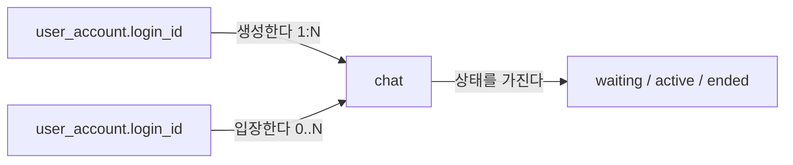
```mermaid
flowchart LR
    UserA["user_account.login_id"] -- "생성한다 1:N" --> Chat["chat"]
    UserB["user_account.login_id"] -- "입장한다 0..N" --> Chat
    Chat -- "상태를 가진다" --> Status["waiting / active / ended"]
```

### **채팅-메시지-미디어 관계**

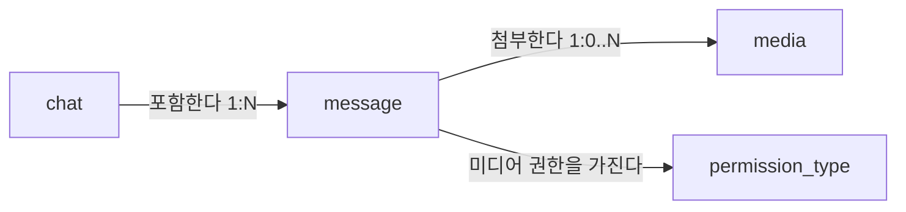
```mermaid
flowchart LR
    Chat["chat"] -- "포함한다 1:N" --> Message["message"]
    Message -- "첨부한다 1:0..N" --> Media["media"]
    Message -- "미디어 권한을 가진다" --> Permission["permission_type"]
```

### **리셋 관계**

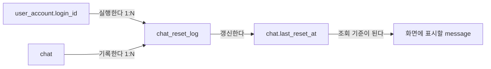
```mermaid
flowchart LR
    User["user_account.login_id"] -- "실행한다 1:N" --> ResetLog["chat_reset_log"]
    Chat["chat"] -- "기록한다 1:N" --> ResetLog
    ResetLog -- "갱신한다" --> LastReset["chat.last_reset_at"]
    LastReset -- "조회 기준이 된다" --> VisibleMessages["화면에 표시할 message"]
```

## **클래스 다이어그램**

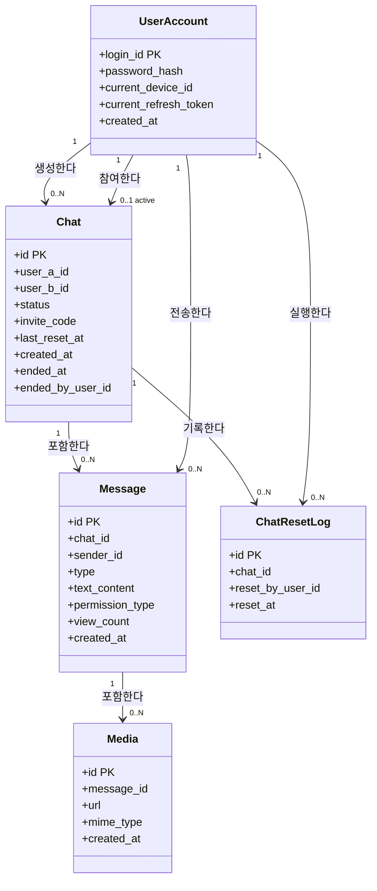
```mermaid
classDiagram
    class UserAccount {
        +login_id PK
        +password_hash
        +current_device_id
        +current_refresh_token
        +created_at
    }

    class Chat {
        +id PK
        +user_a_id
        +user_b_id
        +status
        +invite_code
        +last_reset_at
        +created_at
        +ended_at
        +ended_by_user_id
    }

    class Message {
        +id PK
        +chat_id
        +sender_id
        +type
        +text_content
        +permission_type
        +view_count
        +created_at
    }

    class Media {
        +id PK
        +message_id
        +url
        +mime_type
        +created_at
    }

    class ChatResetLog {
        +id PK
        +chat_id
        +reset_by_user_id
        +reset_at
    }

    UserAccount "1" --> "0..N" Chat : 생성한다
    UserAccount "1" --> "0..1 active" Chat : 참여한다
    Chat "1" --> "0..N" Message : 포함한다
    UserAccount "1" --> "0..N" Message : 전송한다
    Message "1" --> "0..N" Media : 포함한다
    Chat "1" --> "0..N" ChatResetLog : 기록한다
    UserAccount "1" --> "0..N" ChatResetLog : 실행한다
```

## **주요 검증 규칙**

| 규칙                                                                  | 검증 위치                         | 실패 시 동작            |
| --------------------------------------------------------------------- | --------------------------------- | ----------------------- |
| `login_id`는 계정 PK로 중복될 수 없다.                                | DB unique/PK + 가입 API           | 가입 실패               |
| 사용자는 active 채팅방을 동시에 1개만 가질 수 있다.                   | Chat API                          | 생성/입장 실패          |
| 한 채팅방의 최대 인원은 2명이다.                                      | Chat API                          | 입장 실패               |
| 종료된 채팅방에는 메시지/미디어를 보낼 수 없다.                       | Chat/Media API                    | 실패 상태 표시          |
| 메시지 정렬은 `message.id` 증가 순서를 따른다.                        | Message 조회 API                  | 서버 정렬 반환          |
| 리셋은 삭제가 아니라 `last_reset_at` 이후 메시지만 조회하는 방식이다. | Chat reset + Message 조회 API     | 리셋 이전 메시지 미노출 |
| 전송 실패는 자동 재시도하지 않는다.                                   | Flutter Android 앱                | 수동 재전송 버튼 표시   |
| JWT `device_id` claim과 DB `current_device_id`가 일치해야 한다.       | Node.js 인증 미들웨어 (모든 인증 API) | `AUTH_DEVICE_REPLACED`  |

## **추가 검토 후보**

아래 항목은 요구사항상 필요할 수 있지만, `docs.md` 6장 기본 ERD에는 없으므로 기본 엔티티 모델에 포함하지 않았다.

| 후보                 | 필요한 이유                                                                                     |
| -------------------- | ----------------------------------------------------------------------------------------------- |
| `media_view_log`     | 메시지 전체 기준 `view_count`와 별도로 사용자별 열람 이력이나 감사 로그가 필요한 경우 필요하다. |
| `rate_limit_counter` | 로그인/초대코드 5회 실패 후 5분 제한을 DB에 영속화해야 하는 경우 필요하다.                      |
| `push_token`         | FCM 토큰을 사용자/기기별로 관리해야 하는 경우 필요하다.                                         |

## **결정된 정책**

- Access Token 발급 시 `device_id`를 JWT claim으로 포함한다.
- 로그인 이후의 모든 API 요청은 JWT claim의 `device_id`와 DB `user_account.current_device_id`를 대조하는 미들웨어를 통과한다. 불일치 시 `AUTH_DEVICE_REPLACED`를 반환한다.
- `current_refresh_token`은 원문 컬럼명을 유지하되 평문이 아니라 해시로 저장한다.
- `view_count`는 개별 미디어가 아니라 메시지 전체 기준으로 관리한다.
- `once`/`replay_once` 열람 횟수는 클라이언트 렌더링 성공 이후가 아니라, 미디어 열람 요청 시 서버가 `permission_type` 기준 한도를 확인한 직후 `view_count + 1`로 즉시 차감한다.
- 서버는 `view_count` 증가가 성공한 뒤에만 미디어 URL을 발급한다.
- `invite_code`는 고유값이므로 만료 시간이 없고 재발급 정책도 없다.
- `invite_code`는 재사용 가능하다.
- 계정 탈퇴 후 3년 보존을 위한 별도 컬럼은 현재 MVP 엔티티 모델에 포함하지 않는다.
